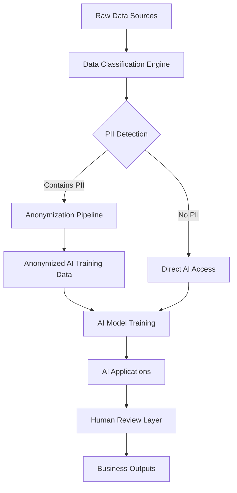
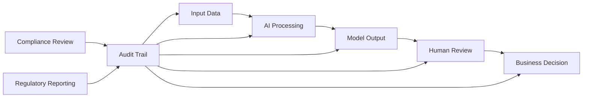

import { Card, Cards } from 'nextra/components'
import { Callout } from 'nextra/components'

Successful AI implementation in fund operations requires robust governance frameworks that balance innovation with risk management, regulatory compliance, and fiduciary responsibility. This page outlines the essential governance components for responsible AI deployment that maintains investor trust while delivering operational value.

## Core Governance Principles

Effective AI governance in fund operations is built on four foundational principles that ensure responsible deployment while enabling business value creation.

<Cards>
  <Card title="Transparency & Explainability" icon="🔍">
    All AI decisions must be explainable to stakeholders, regulators, and auditors with clear traceability from inputs to outputs.
  </Card>
  
  <Card title="Human Oversight & Control" icon="👥">
    Critical decisions remain under human control with AI providing analysis and recommendations rather than autonomous decision-making.
  </Card>
  
  <Card title="Risk Management & Compliance" icon="🛡️">
    AI implementations must meet regulatory requirements and fund compliance standards with appropriate risk controls and monitoring.
  </Card>
  
  <Card title="Continuous Monitoring & Improvement" icon="📊">
    AI systems require ongoing monitoring for performance, bias, and business impact with regular updates and improvements.
  </Card>
</Cards>

## Data Privacy and PII Handling

Fund operations involve sensitive investor information, portfolio company data, and proprietary investment strategies that require careful protection in AI implementations.

### PII Protection Framework

**Data Classification and Handling**:
- **Public Data**: Market information, public company financials - minimal restrictions
- **Internal Data**: Fund performance metrics, portfolio analytics - role-based access controls
- **Confidential Data**: Investor information, proprietary strategies - strict access controls and encryption
- **Restricted Data**: Personal investor details, compliance-sensitive information - human-only access with audit trails

**AI System Access Controls**:

**Implementation Requirements**:
- Automated PII detection and classification for all data inputs
- Anonymization and pseudonymization techniques for AI training data
- Role-based access controls that align with fund compliance requirements
- Audit trails for all data access and AI system interactions

### Data Retention and Deletion

**AI-Specific Data Lifecycle Management**:
- Training data retention policies that balance model performance with privacy requirements
- Automated deletion of personal data when no longer needed for business purposes
- Model versioning that maintains compliance with data retention requirements
- Clear procedures for data subject requests and regulatory inquiries

## Policy Enforcement and Access Boundaries

AI systems must operate within clearly defined boundaries that align with fund policies, regulatory requirements, and risk tolerance.

### Access Control Framework

**Role-Based AI Access**:

<Card title="Investment Team Access" icon="💼">
**Permitted AI Functions**: Deal sourcing analytics, due diligence support, portfolio performance analysis
**Restricted Functions**: Direct investor communication, regulatory filing generation, compliance decisions
**Oversight Requirements**: Investment committee review of AI recommendations, audit trail of all AI-assisted decisions
</Card>

<Card title="Operations Team Access" icon="⚙️">
**Permitted AI Functions**: Data validation, report generation, performance monitoring, compliance checking
**Restricted Functions**: Investment decisions, investor communication approval, regulatory submissions
**Oversight Requirements**: Operations manager approval for automated processes, regular review of AI accuracy
</Card>

<Card title="Finance/IR Team Access" icon="📈">
**Permitted AI Functions**: Financial reporting, investor communication drafting, performance analytics, cash flow modeling
**Restricted Functions**: Final investor communications, regulatory filings, material disclosure decisions
**Oversight Requirements**: CFO approval for external communications, compliance review of AI-generated content
</Card>

### Policy Enforcement Mechanisms

**Automated Policy Controls**:
- Real-time monitoring of AI system actions against defined policies
- Automatic blocking of AI operations that exceed authorized boundaries
- Escalation procedures for policy violations or edge cases
- Regular policy compliance auditing and reporting

**Human Override Capabilities**:
- Clear procedures for human override of AI recommendations
- Documentation requirements for all overrides with business justification
- Regular review of override patterns to identify policy or model improvements
- Training programs for staff on appropriate AI use and override procedures

## Auditability of AI Outputs

Fund operations require comprehensive audit trails that demonstrate compliance with regulatory requirements and fiduciary responsibilities.

### Comprehensive Audit Trail Framework

**Model Lineage Tracking**:
- Complete documentation of AI model development, training data, and validation processes
- Version control for all model updates with change documentation and approval records
- Traceability from business outputs back to specific model versions and input data
- Regular model performance reviews with documented outcomes and improvement plans

**Decision Audit Trails**:

**Required Documentation**:
- Input data sources and quality validation for each AI decision
- Model confidence scores and uncertainty measures
- Human review processes and approval decisions
- Business impact and outcome measurement
- Exception handling and error correction procedures

### Regulatory Compliance Documentation

**SEC and Regulatory Requirements**:
- Documentation of AI use in investment decision-making processes
- Demonstration of appropriate human oversight and control
- Evidence of risk management and compliance monitoring
- Clear explanation of AI capabilities and limitations for regulatory review

**Investor Reporting Requirements**:
- Disclosure of AI use in fund operations where material to performance
- Explanation of AI governance and risk management frameworks
- Documentation of AI impact on fund performance and operations
- Regular reporting on AI system performance and business outcomes

## Feedback Capture and Continuous Improvement

AI systems require continuous learning and improvement based on business outcomes and human feedback.

### Feedback Collection Framework

**Systematic Feedback Mechanisms**:

<Cards>
  <Card title="User Feedback" icon="👤">
    Regular collection of feedback from AI system users on accuracy, usefulness, and areas for improvement.
  </Card>
  
  <Card title="Outcome Tracking" icon="📊">
    Measurement of business outcomes from AI recommendations to validate model effectiveness and business value.
  </Card>
  
  <Card title="Error Analysis" icon="🔍">
    Systematic analysis of AI errors and human overrides to identify improvement opportunities and model limitations.
  </Card>
  
  <Card title="Performance Monitoring" icon="📈">
    Continuous monitoring of AI model performance with automated alerts for degradation or bias detection.
  </Card>
</Cards>

**Improvement Process**:
1. **Regular Performance Review**: Monthly assessment of AI system performance against business objectives
2. **Model Retraining**: Quarterly model updates incorporating new data and feedback
3. **Policy Updates**: Semi-annual review of AI governance policies based on experience and regulatory changes
4. **Capability Expansion**: Annual assessment of new AI capabilities and business applications

### Bias Detection and Mitigation

**Ongoing Bias Monitoring**:
- Statistical analysis of AI outputs for systematic bias across different scenarios
- Regular testing with diverse datasets to identify potential discrimination
- Human review processes designed to catch and correct biased recommendations
- Documentation of bias detection and mitigation efforts for regulatory compliance

**Mitigation Strategies**:
- Diverse training data that represents full range of fund operations scenarios
- Regular model validation using holdout datasets and cross-validation techniques
- Human oversight processes that include bias awareness training
- Clear escalation procedures for suspected bias in AI recommendations

## Telemetry Measurement and Performance Tracking

Effective AI governance requires comprehensive measurement of system performance, business impact, and risk indicators.

### Key Performance Indicators (KPIs)

**Technical Performance Metrics**:
- Model accuracy and precision across different use cases
- System uptime and response time for AI applications
- Data quality scores for AI input datasets
- Error rates and exception handling effectiveness

**Business Impact Metrics**:
- Time savings from AI automation (target: 50-70% for routine tasks)
- Accuracy improvements in forecasting and analysis (target: 30-40% improvement)
- Cost reduction from operational efficiency gains
- User satisfaction scores for AI-assisted workflows

**Risk and Compliance Metrics**:
- Policy compliance rates for AI system operations
- Audit finding rates related to AI implementations
- Regulatory inquiry response times and outcomes
- Investor complaint rates related to AI-assisted processes

### Gradual Scope Expansion Using "Adapt → Align → Upgrade"

The "Adapt → Align → Upgrade" methodology provides a framework for gradually expanding AI capabilities while maintaining appropriate governance and risk controls.

<Callout type="info">
**Adapt Phase**: AI systems initially adapt to existing processes and workflows, providing analysis and recommendations while humans maintain full decision authority.
</Callout>

**Adapt Phase Governance**:
- AI provides analysis and recommendations only
- All decisions remain with human operators
- Comprehensive logging of AI recommendations and human decisions
- Regular review of AI accuracy and business value

<Callout type="warning">
**Align Phase**: As confidence builds, AI systems take on more operational responsibilities within clearly defined boundaries while maintaining human oversight.
</Callout>

**Align Phase Governance**:
- AI can execute routine operations within defined parameters
- Human approval required for exceptions or high-impact decisions
- Automated monitoring for policy compliance and performance
- Regular calibration of AI decision boundaries based on performance

<Callout type="success">
**Upgrade Phase**: Mature AI implementations operate with significant autonomy while maintaining appropriate oversight and continuous improvement.
</Callout>

**Upgrade Phase Governance**:
- AI operates autonomously for well-defined use cases
- Exception-based human oversight with comprehensive monitoring
- Continuous learning and model improvement based on outcomes
- Regular strategic review of AI capabilities and business impact

## Implementation Roadmap

### Phase 1: Foundation (Months 1-3)
**Governance Setup**:
- Establish AI governance committee with clear roles and responsibilities
- Develop initial AI policies and procedures
- Implement basic audit trail and monitoring capabilities
- Train staff on AI governance requirements and procedures

**Risk Management**:
- Conduct initial risk assessment for planned AI implementations
- Establish data classification and access control frameworks
- Implement PII protection and anonymization procedures
- Create incident response procedures for AI-related issues

### Phase 2: Controlled Deployment (Months 3-9)
**Pilot Implementation**:
- Deploy AI systems in controlled environments with comprehensive monitoring
- Establish feedback collection and performance measurement systems
- Conduct regular governance reviews and policy adjustments
- Build internal expertise in AI risk management and compliance

**Compliance Integration**:
- Integrate AI governance with existing compliance frameworks
- Develop regulatory reporting procedures for AI implementations
- Establish audit procedures for AI systems and decisions
- Create documentation templates for regulatory and investor reporting

### Phase 3: Scaled Operations (Months 9+)
**Mature Governance**:
- Implement advanced monitoring and bias detection capabilities
- Establish continuous improvement processes based on performance data
- Expand AI capabilities based on proven governance frameworks
- Develop thought leadership in responsible AI for fund operations

## Getting Professional Guidance

AI governance in fund operations requires specialized expertise that combines technology, regulatory compliance, and fiduciary responsibility. Our team can help you develop governance frameworks that enable AI innovation while maintaining appropriate risk controls.

**Governance Assessment Services**:
- Review of current data governance and compliance frameworks
- Gap analysis for AI-specific governance requirements
- Development of AI policies and procedures tailored to fund operations
- Training programs for staff on responsible AI use and oversight

**Implementation Support**:
- Technical implementation of audit trails and monitoring systems
- Integration of AI governance with existing compliance frameworks
- Ongoing monitoring and performance measurement support
- Regular governance reviews and policy updates

[Schedule AI Governance Consultation →](/contact)

[Assess Your AI Readiness →](/fund-leaders/ai-readiness/readiness-model)

[Explore AI Use Cases →](/fund-leaders/ai-readiness/use-cases)