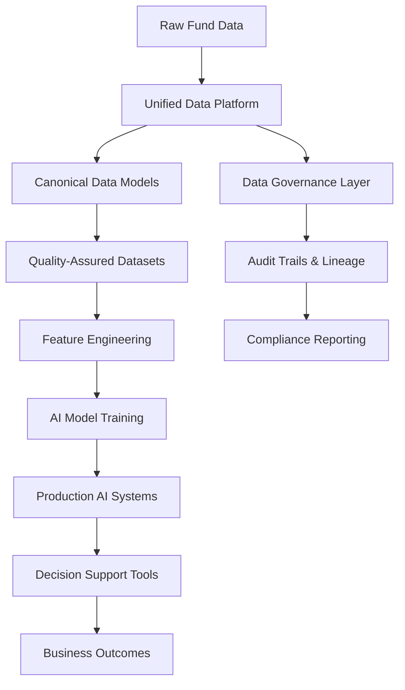

import { Card, Cards } from 'nextra/components'

# AI Readiness & Enablement

The promise of AI in fund management is compelling: automated due diligence, intelligent portfolio optimization, predictive analytics for exits, and streamlined investor reporting. Yet most funds struggle to move beyond pilot projects to production AI systems that deliver measurable business value.

The fundamental challenge isn't the AI technology itself—it's the data foundation required to make AI work reliably at scale.

## Why Unified Data Platforms Are Prerequisites for AI

AI systems are only as good as the data they consume. In fund operations, this creates a unique challenge: your most valuable insights come from connecting data across multiple systems—fund administration, portfolio management, CRM, market data, and operational metrics.

<Cards>
  <Card title="Data Quality Requirements" icon="🎯">
    AI models require consistent, clean, and contextually rich data. Fragmented systems with inconsistent formats and definitions make reliable AI impossible.
  </Card>
  
  <Card title="Real-Time Decision Support" icon="⚡">
    Investment decisions happen quickly. AI systems need access to current, complete data across all relevant sources to provide timely insights.
  </Card>
  
  <Card title="Governance and Auditability" icon="🔍">
    Fund operations require clear audit trails. AI recommendations must be traceable back to source data with full lineage documentation.
  </Card>
  
  <Card title="Regulatory Compliance" icon="📋">
    AI systems in financial services must meet strict compliance requirements, including explainability and bias detection capabilities.
  </Card>
</Cards>

## Common AI Blockers and How Amos Addresses Them

Most funds encounter predictable obstacles when attempting AI initiatives. Amos systematically addresses each of these blockers:

### Data Fragmentation
**The Problem**: Investment data lives in fund admin systems, portfolio data in separate tools, market data in third-party feeds, and operational metrics in spreadsheets.

**How Amos Solves It**: Creates a unified data layer that consolidates all fund-relevant data sources into consistent, queryable formats with maintained lineage.

### Inconsistent Data Definitions
**The Problem**: The same concept (like "committed capital" or "portfolio company valuation") has different definitions and calculations across systems.

**How Amos Solves It**: Implements canonical data models with standardized definitions, ensuring AI models work with consistent, well-defined inputs.

### Data Quality Issues
**The Problem**: Missing values, duplicate records, and inconsistent formats make AI model training unreliable and predictions untrustworthy.

**How Amos Solves It**: Built-in data quality monitoring, automated cleansing pipelines, and validation rules that ensure AI-ready data quality.

### Lack of Historical Context
**The Problem**: AI models need historical patterns, but legacy systems often lack comprehensive historical data or have it in incompatible formats.

**How Amos Solves It**: Preserves full historical context through time-series data models and snapshot capabilities, creating rich datasets for model training.

### Governance Gaps
**The Problem**: AI initiatives fail compliance reviews due to unclear data lineage, inadequate access controls, or insufficient audit trails.

**How Amos Solves It**: Version-controlled configurations, comprehensive audit logs, and role-based access controls that meet regulatory requirements.

## The Data-to-AI Flow

Amos enables a systematic progression from raw operational data to AI-powered insights:

### Stage 1: Data Consolidation
Amos ingests data from all fund systems, creating a single source of truth with maintained source system lineage.

### Stage 2: Standardization
Raw data is transformed into canonical formats with consistent definitions, making it suitable for cross-system analysis.

### Stage 3: Quality Assurance
Automated data quality checks ensure AI models receive reliable, complete inputs with known confidence levels.

### Stage 4: Feature Engineering
Business-relevant features are created and maintained, providing AI models with meaningful inputs for fund-specific use cases.

### Stage 5: AI Integration
Clean, governed data feeds into AI systems through well-defined APIs with appropriate access controls and monitoring.

## Governance Requirements for AI Success

Successful AI implementations in fund operations require robust governance frameworks that Amos enables:

### Data Lineage and Traceability
Every AI recommendation must be traceable back to source data. Amos maintains complete lineage from raw inputs through transformations to final outputs.

### Access Control and Security
AI systems need appropriate data access without compromising security. Amos implements role-based access controls that align with fund compliance requirements.

### Model Monitoring and Validation
AI models degrade over time and need continuous monitoring. Amos provides the data infrastructure for model performance tracking and validation.

### Regulatory Compliance
Fund AI initiatives must meet regulatory requirements for explainability, bias detection, and audit trails. Amos provides the foundational data governance to support these requirements.

## Getting Started with AI Readiness

Your AI readiness journey begins with assessing your current data maturity and identifying the gaps that prevent successful AI implementations.

<Cards>
  <Card title="Assess Current State" icon="📊">
    Evaluate your data fragmentation, quality issues, and governance gaps using our AI readiness framework.
  </Card>
  
  <Card title="Plan Your Progression" icon="🗺️">
    Develop a roadmap from your current state to AI-ready data infrastructure with clear milestones.
  </Card>
  
  <Card title="Start with High-Impact Use Cases" icon="🎯">
    Identify AI applications that deliver immediate business value while building foundational capabilities.
  </Card>
  
  <Card title="Build Governance Early" icon="🛡️">
    Establish data governance practices that scale with your AI ambitions and meet compliance requirements.
  </Card>
</Cards>

## Next Steps

Ready to evaluate your fund's AI readiness? Our assessment framework helps you understand where you stand and what steps will unlock AI capabilities for your operations.

[Assess Your AI Readiness →](/fund-leaders/ai-readiness/readiness-model)

[Explore AI Use Cases →](/fund-leaders/ai-readiness/use-cases)

[Review AI Governance →](/fund-leaders/ai-readiness/governance)