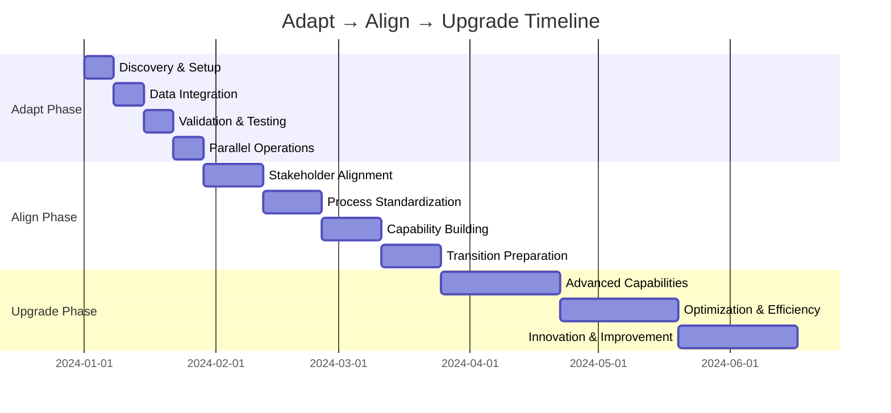

## Methodology Overview

The Adapt → Align → Upgrade methodology is specifically designed for fund operations where disruption to critical processes can have significant business impact. This approach ensures continuous operation while systematically transforming your data capabilities.

<Card title="Why This Approach Works for Funds" icon="lightbulb">
Fund operations require precision, compliance, and reliability. Traditional "big bang" implementations risk disrupting investor reporting, regulatory compliance, and deal processes. Our phased approach maintains operational continuity while building organizational confidence and capability.
</Card>

## Phase 1: Adapt (Weeks 1-4)

### Philosophy: Meet You Where You Are

The Adapt phase focuses on integrating Amos with your existing systems and processes without forcing immediate changes. This builds trust and demonstrates value quickly.

### Key Objectives
- Establish data connectivity with minimal disruption
- Prove data accuracy and reliability
- Build stakeholder confidence
- Document current state for future optimization

### Detailed Activities

<Tabs>
  <Tab title="Week 1: Discovery & Setup">
    **Technical Activities:**
    - Install Amos connectors for existing systems
    - Configure initial data pipelines
    - Set up development and staging environments
    - Establish security and access controls
    
    **Organizational Activities:**
    - Conduct stakeholder interviews
    - Document current reporting processes
    - Identify key data sources and dependencies
    - Establish project communication channels
    
    **Deliverables:**
    - Technical architecture diagram
    - Current state process documentation
    - Initial data quality assessment
    - Project charter and communication plan
  </Tab>
  
  <Tab title="Week 2: Data Integration">
    **Technical Activities:**
    - Connect to fund administration systems
    - Integrate portfolio management platforms
    - Set up CRM and deal pipeline connections
    - Configure regulatory reporting data sources
    
    **Organizational Activities:**
    - Train technical team on Amos platform
    - Establish data governance working group
    - Create change management communication plan
    - Begin stakeholder education sessions
    
    **Deliverables:**
    - Functional data pipelines
    - Data lineage documentation
    - Training materials and schedules
    - Governance framework draft
  </Tab>
  
  <Tab title="Week 3: Validation & Testing">
    **Technical Activities:**
    - Validate data accuracy against source systems
    - Test reporting output consistency
    - Implement data quality monitoring
    - Set up backup and recovery procedures
    
    **Organizational Activities:**
    - Conduct user acceptance testing sessions
    - Gather feedback on initial outputs
    - Address concerns and resistance
    - Refine training programs
    
    **Deliverables:**
    - Data validation reports
    - User feedback summary
    - Updated training materials
    - Risk mitigation plans
  </Tab>
  
  <Tab title="Week 4: Parallel Operations">
    **Technical Activities:**
    - Run parallel reporting processes
    - Monitor system performance and reliability
    - Fine-tune data quality rules
    - Prepare for Phase 2 activities
    
    **Organizational Activities:**
    - Demonstrate value to key stakeholders
    - Celebrate early wins and successes
    - Plan Phase 2 alignment activities
    - Conduct Phase 1 retrospective
    
    **Deliverables:**
    - Parallel reporting validation
    - Stakeholder confidence assessment
    - Phase 2 detailed plan
    - Lessons learned documentation
  </Tab>
</Tabs>

### RACI Matrix - Adapt Phase

| Activity | Fund Leadership | IT/Data Team | Operations Team | External Vendors |
|----------|----------------|--------------|-----------------|------------------|
| Project Sponsorship | **A** | C | C | I |
| Technical Implementation | C | **R** | C | **R** |
| Process Documentation | I | C | **R** | C |
| Stakeholder Communication | **R** | C | C | I |
| Change Management | **A** | C | **R** | C |
| Risk Management | **A** | **R** | C | C |

**Legend:** R = Responsible, A = Accountable, C = Consulted, I = Informed

### Success Criteria
- [ ] All critical data sources connected and validated
- [ ] Reporting outputs match existing systems within 99.5% accuracy
- [ ] No disruption to month-end or regulatory reporting cycles
- [ ] Stakeholder confidence score above 7/10
- [ ] Technical team trained and comfortable with platform

## Phase 2: Align (Weeks 5-12)

### Philosophy: Build Consensus and Shared Vision

The Align phase focuses on bringing stakeholders together around improved processes and shared data definitions while maintaining operational stability.

### Key Objectives
- Establish organizational consensus on target state
- Implement governance frameworks and policies
- Standardize processes across teams
- Build change management momentum

### Detailed Activities

<Tabs>
  <Tab title="Weeks 5-6: Stakeholder Alignment">
    **Governance Activities:**
    - Conduct stakeholder alignment workshops
    - Define target state vision and objectives
    - Establish data governance policies
    - Create decision-making frameworks
    
    **Process Activities:**
    - Map current vs. target state processes
    - Identify process improvement opportunities
    - Design new workflow patterns
    - Plan process transition strategies
    
    **Deliverables:**
    - Target state vision document
    - Data governance charter
    - Process improvement roadmap
    - Stakeholder alignment assessment
  </Tab>
  
  <Tab title="Weeks 7-8: Process Standardization">
    **Technical Activities:**
    - Implement standardized data models
    - Create shared business logic and calculations
    - Establish common reporting templates
    - Set up automated data quality monitoring
    
    **Organizational Activities:**
    - Develop role-specific training programs
    - Create process documentation and procedures
    - Establish communication protocols
    - Begin culture change initiatives
    
    **Deliverables:**
    - Standardized data models
    - Process documentation library
    - Training curriculum and materials
    - Communication plan execution
  </Tab>
  
  <Tab title="Weeks 9-10: Capability Building">
    **Training Activities:**
    - Deliver role-specific training programs
    - Conduct hands-on workshops and simulations
    - Establish peer mentoring networks
    - Create self-service learning resources
    
    **Governance Activities:**
    - Implement data stewardship programs
    - Establish quality assurance processes
    - Create escalation and issue resolution procedures
    - Set up performance monitoring frameworks
    
    **Deliverables:**
    - Trained user base across all roles
    - Data stewardship program
    - Quality assurance procedures
    - Performance monitoring dashboards
  </Tab>
  
  <Tab title="Weeks 11-12: Transition Preparation">
    **Technical Activities:**
    - Prepare production deployment procedures
    - Test disaster recovery and backup systems
    - Validate security and compliance controls
    - Optimize system performance
    
    **Organizational Activities:**
    - Conduct readiness assessments
    - Plan go-live communication and support
    - Prepare rollback procedures if needed
    - Celebrate alignment achievements
    
    **Deliverables:**
    - Production readiness checklist
    - Go-live support plan
    - Rollback procedures
    - Phase 2 success metrics
  </Tab>
</Tabs>

### RACI Matrix - Align Phase

| Activity | Fund Leadership | Data Governance Team | Operations Teams | IT Support |
|----------|----------------|---------------------|------------------|------------|
| Vision Setting | **A** | C | C | I |
| Governance Framework | **A** | **R** | C | C |
| Process Design | C | **R** | **R** | C |
| Training Delivery | C | **R** | C | **R** |
| Change Communication | **R** | C | C | I |
| Quality Assurance | **A** | **R** | C | C |

### Success Criteria
- [ ] 90%+ stakeholder alignment on target state vision
- [ ] Data governance policies approved and implemented
- [ ] All user roles trained and certified
- [ ] Process documentation complete and approved
- [ ] Quality metrics established and baseline measured

## Phase 3: Upgrade (Weeks 13-24)

### Philosophy: Optimize and Innovate

The Upgrade phase leverages the foundation built in previous phases to implement advanced capabilities and drive continuous improvement.

### Key Objectives
- Implement advanced analytics and automation
- Enable self-service capabilities for authorized users
- Optimize processes for efficiency and effectiveness
- Establish continuous improvement culture

### Detailed Activities

<Tabs>
  <Tab title="Weeks 13-16: Advanced Capabilities">
    **Analytics Implementation:**
    - Deploy advanced reporting and dashboards
    - Implement predictive analytics models
    - Create real-time monitoring and alerting
    - Enable ad-hoc analysis capabilities
    
    **Automation Development:**
    - Automate routine reporting processes
    - Implement workflow automation
    - Create exception-based management systems
    - Deploy intelligent data validation
    
    **Deliverables:**
    - Advanced analytics platform
    - Automated workflow systems
    - Real-time monitoring dashboards
    - Self-service analytics tools
  </Tab>
  
  <Tab title="Weeks 17-20: Optimization & Efficiency">
    **Process Optimization:**
    - Streamline reporting cycles and procedures
    - Eliminate redundant manual processes
    - Optimize data refresh and processing schedules
    - Implement continuous monitoring
    
    **Performance Enhancement:**
    - Optimize system performance and scalability
    - Implement caching and acceleration
    - Enhance user experience and interfaces
    - Deploy mobile and remote access capabilities
    
    **Deliverables:**
    - Optimized process workflows
    - Performance enhancement results
    - Enhanced user interfaces
    - Mobile access capabilities
  </Tab>
  
  <Tab title="Weeks 21-24: Innovation & Continuous Improvement">
    **Innovation Initiatives:**
    - Explore AI and machine learning applications
    - Implement advanced risk management tools
    - Create predictive modeling capabilities
    - Enable scenario analysis and stress testing
    
    **Continuous Improvement:**
    - Establish feedback loops and improvement cycles
    - Create innovation labs and experimentation
    - Implement user-driven enhancement processes
    - Build center of excellence capabilities
    
    **Deliverables:**
    - AI/ML pilot implementations
    - Innovation pipeline and roadmap
    - Continuous improvement framework
    - Center of excellence establishment
  </Tab>
</Tabs>

### RACI Matrix - Upgrade Phase

| Activity | Fund Leadership | Center of Excellence | Power Users | IT Operations |
|----------|----------------|---------------------|-------------|---------------|
| Innovation Strategy | **A** | **R** | C | I |
| Advanced Analytics | C | **R** | **R** | C |
| Process Optimization | **A** | **R** | C | C |
| Performance Monitoring | C | **R** | C | **R** |
| Continuous Improvement | **A** | **R** | **R** | C |
| Technology Evolution | C | **R** | C | **R** |

### Success Criteria
- [ ] 50%+ reduction in manual reporting processes
- [ ] Real-time data availability for critical metrics
- [ ] Self-service adoption rate above 70%
- [ ] Continuous improvement processes established
- [ ] Innovation pipeline with 3+ active projects

## Timeline Expectations and Milestones

### Typical Timeline Overview

### Key Milestones and Gates

<CardGroup cols={3}>
  <Card title="Adapt Gate" icon="check-circle">
    **Criteria for Phase 2:**
    - Data accuracy validated
    - Stakeholder confidence achieved
    - No operational disruption
    - Technical foundation stable
  </Card>
  
  <Card title="Align Gate" icon="users">
    **Criteria for Phase 3:**
    - Stakeholder alignment achieved
    - Governance framework implemented
    - Training completed
    - Processes standardized
  </Card>
  
  <Card title="Success Gate" icon="trophy">
    **Transformation Complete:**
    - Advanced capabilities deployed
    - Optimization targets met
    - Innovation culture established
    - Continuous improvement active
  </Card>
</CardGroup>

## Risk Management and Contingency Planning

### Phase-Specific Risks and Mitigations

<Accordion>
  <AccordionItem title="Adapt Phase Risks">
    **Risk:** Data integration complexity exceeds estimates
    **Mitigation:** Phased integration approach, fallback to manual processes, extended timeline if needed
    
    **Risk:** Stakeholder resistance to change
    **Mitigation:** Enhanced communication, early wins demonstration, executive sponsorship
    
    **Risk:** Technical performance issues
    **Mitigation:** Thorough testing, performance monitoring, scalability planning
  </AccordionItem>
  
  <AccordionItem title="Align Phase Risks">
    **Risk:** Stakeholder alignment difficulties
    **Mitigation:** Facilitated workshops, compromise solutions, phased consensus building
    
    **Risk:** Training adoption challenges
    **Mitigation:** Multiple delivery methods, peer mentoring, incentive programs
    
    **Risk:** Process standardization resistance
    **Mitigation:** Gradual implementation, pilot testing, feedback incorporation
  </AccordionItem>
  
  <AccordionItem title="Upgrade Phase Risks">
    **Risk:** Advanced capabilities complexity
    **Mitigation:** Pilot implementations, user feedback loops, iterative development
    
    **Risk:** Performance degradation
    **Mitigation:** Continuous monitoring, optimization cycles, infrastructure scaling
    
    **Risk:** Innovation initiative failures
    **Mitigation:** Portfolio approach, fail-fast methodology, learning culture
  </AccordionItem>
</Accordion>

## Measuring Success Across Phases

### Key Performance Indicators by Phase

| Metric Category | Adapt Phase | Align Phase | Upgrade Phase |
|----------------|-------------|-------------|---------------|
| **Technical** | Data accuracy, System uptime | Process standardization, Quality metrics | Performance optimization, Innovation adoption |
| **Organizational** | Stakeholder confidence, Training completion | Alignment scores, Governance maturity | Culture change, Continuous improvement |
| **Business** | Operational continuity, Risk mitigation | Efficiency gains, Process improvement | Value creation, Competitive advantage |

<Card title="Ready to Begin Your Transformation?" icon="rocket">
The Adapt → Align → Upgrade methodology provides a proven path to successful data platform transformation. Our experienced team will guide you through each phase, ensuring minimal risk and maximum value realization.

[Contact our Change Management Experts](/contact) to discuss your specific transformation needs and develop a customized implementation plan.
</Card>