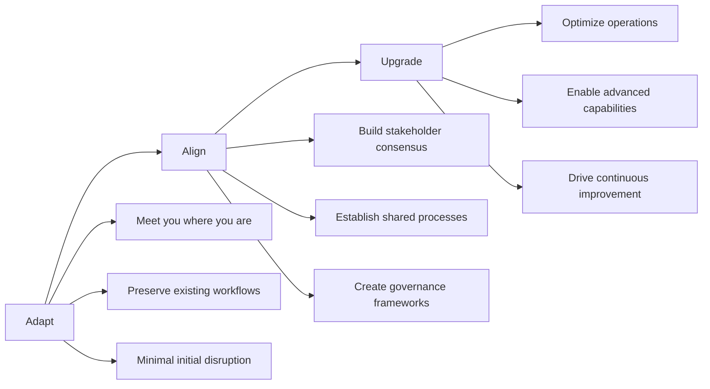

# Change Management & Adoption Framework

## Why Change Management Matters in Fund Operations

Fund operations are built on precision, compliance, and trust. When implementing a unified data platform like Amos, success depends not just on technical integration, but on how well your organization adapts to new processes, aligns stakeholders around common goals, and upgrades operational capabilities.

<Card title="The Cost of Poor Change Management" icon="warning">
Studies show that 70% of data transformation projects fail due to organizational resistance, not technical issues. In fund management, this translates to:
- Continued data silos and manual processes
- Delayed investor reporting and compliance issues  
- Missed opportunities for operational efficiency
- Reduced competitive advantage in deal sourcing and portfolio management
</Card>

## The Adapt → Align → Upgrade Methodology

Amos follows a proven three-phase approach to organizational transformation that minimizes disruption while maximizing adoption:

### Phase 1: Adapt
**Duration: 2-4 weeks**

Amos first adapts to your current state, integrating with existing systems and processes without forcing immediate changes. This builds confidence and demonstrates value quickly.

**Key Activities:**
- Connect to existing data sources with minimal configuration
- Replicate current reporting outputs to prove data accuracy
- Provide parallel systems during transition period
- Document current state processes and pain points

### Phase 2: Align  
**Duration: 4-8 weeks**

Once stakeholders see Amos working with their current processes, we align the organization around improved workflows and shared data definitions.

**Key Activities:**
- Facilitate stakeholder workshops to define target state
- Establish data governance policies and procedures
- Create training programs for different user roles
- Implement change management communication plans

### Phase 3: Upgrade
**Duration: 8-12 weeks**

With alignment achieved, we upgrade operations to leverage Amos's full capabilities, enabling advanced analytics, automation, and AI readiness.

**Key Activities:**
- Implement advanced reporting and analytics capabilities
- Enable self-service data access for authorized users
- Deploy automated workflows and alerts
- Establish continuous improvement processes

## Organizational Transformation Stages

<Tabs>
  <Tab title="People & Culture">
    ### Cultural Transformation Journey
    
    **Stage 1: Awareness**
    - Leadership communicates vision and rationale
    - Teams understand "what's in it for me"
    - Address concerns and resistance openly
    
    **Stage 2: Adoption**
    - Provide role-specific training and support
    - Celebrate early wins and success stories
    - Establish peer champions and advocates
    
    **Stage 3: Mastery**
    - Enable advanced use cases and self-service
    - Foster data-driven decision making culture
    - Continuous learning and capability development
  </Tab>
  
  <Tab title="Process & Governance">
    ### Process Evolution Framework
    
    **Stage 1: Documentation**
    - Map current state processes and data flows
    - Identify inefficiencies and pain points
    - Establish baseline metrics for improvement
    
    **Stage 2: Standardization**
    - Define target state processes and workflows
    - Implement data governance policies
    - Create standard operating procedures
    
    **Stage 3: Optimization**
    - Automate routine tasks and workflows
    - Enable exception-based management
    - Continuous process improvement cycles
  </Tab>
  
  <Tab title="Technology & Capabilities">
    ### Technology Maturity Progression
    
    **Stage 1: Integration**
    - Connect existing systems and data sources
    - Establish data quality and validation rules
    - Implement basic reporting capabilities
    
    **Stage 2: Consolidation**
    - Centralize data management and governance
    - Enable cross-functional analytics and insights
    - Implement role-based access controls
    
    **Stage 3: Innovation**
    - Deploy advanced analytics and AI capabilities
    - Enable real-time decision support systems
    - Foster data product development mindset
  </Tab>
</Tabs>

## Success Factors for Fund Transformation

### Executive Sponsorship
Strong leadership commitment is essential for successful transformation. Fund leaders must:
- Communicate clear vision and expected outcomes
- Allocate necessary resources and remove obstacles
- Model data-driven decision making behaviors
- Celebrate successes and learn from setbacks

### Stakeholder Engagement
Different stakeholders have different needs and concerns:

<CardGroup cols={2}>
  <Card title="Investment Team" icon="chart-line">
    **Primary Concerns:** Deal flow insights, portfolio performance, market analysis
    **Success Metrics:** Faster due diligence, better portfolio monitoring, improved returns
  </Card>
  
  <Card title="Operations Team" icon="cogs">
    **Primary Concerns:** Process efficiency, compliance, reporting accuracy
    **Success Metrics:** Reduced manual work, faster reporting cycles, fewer errors
  </Card>
  
  <Card title="Finance Team" icon="calculator">
    **Primary Concerns:** Financial reporting, investor relations, regulatory compliance
    **Success Metrics:** Automated reporting, real-time insights, audit readiness
  </Card>
  
  <Card title="Compliance Team" icon="shield-check">
    **Primary Concerns:** Regulatory requirements, audit trails, risk management
    **Success Metrics:** Complete audit trails, automated compliance checks, risk visibility
  </Card>
</CardGroup>

### Communication Strategy
Effective change management requires ongoing communication:

- **Regular Updates:** Monthly progress reports and success stories
- **Training Programs:** Role-specific training and certification paths  
- **Feedback Loops:** Regular surveys and feedback sessions
- **Recognition:** Celebrate early adopters and success stories

## Risk Mitigation Strategies

### Common Change Resistance Patterns

<Accordion>
  <AccordionItem title="Data Quality Concerns">
    **Concern:** "Our current data isn't clean enough for a unified platform"
    
    **Mitigation:** 
    - Start with data profiling and quality assessment
    - Implement gradual data cleansing processes
    - Show improvement metrics over time
    - Provide data quality dashboards for transparency
  </AccordionItem>
  
  <AccordionItem title="Process Disruption Fears">
    **Concern:** "This will disrupt our critical month-end processes"
    
    **Mitigation:**
    - Maintain parallel systems during transition
    - Schedule changes around reporting cycles
    - Provide rollback capabilities for critical periods
    - Test thoroughly in non-production environments
  </AccordionItem>
  
  <AccordionItem title="Skills Gap Anxiety">
    **Concern:** "Our team doesn't have the technical skills for this"
    
    **Mitigation:**
    - Provide comprehensive training programs
    - Offer different skill development paths
    - Bring in temporary expertise during transition
    - Create internal champion networks
  </AccordionItem>
  
  <AccordionItem title="Vendor Lock-in Worries">
    **Concern:** "What if we need to change platforms later?"
    
    **Mitigation:**
    - Emphasize open source components and standards
    - Provide data export capabilities and documentation
    - Maintain transparent pricing and contract terms
    - Show examples of successful migrations if needed
  </AccordionItem>
</Accordion>

## Next Steps

Ready to begin your transformation journey? Here's how to get started:

<Steps>
  <Step title="Assessment">
    Complete our organizational readiness assessment to understand your current state and transformation requirements.
  </Step>
  
  <Step title="Planning">
    Work with our change management experts to develop a customized transformation plan for your fund.
  </Step>
  
  <Step title="Pilot">
    Start with a focused pilot project to demonstrate value and build organizational confidence.
  </Step>
  
  <Step title="Scale">
    Expand successful patterns across your organization using the Adapt → Align → Upgrade methodology.
  </Step>
</Steps>

<Card title="Ready to Transform Your Fund Operations?" icon="rocket">
Our change management experts are ready to help you navigate your transformation journey. Contact us to discuss your specific needs and develop a customized approach.

[Schedule a Consultation](/contact) or [Download our Change Readiness Assessment](/resources/change-readiness-assessment)
</Card>