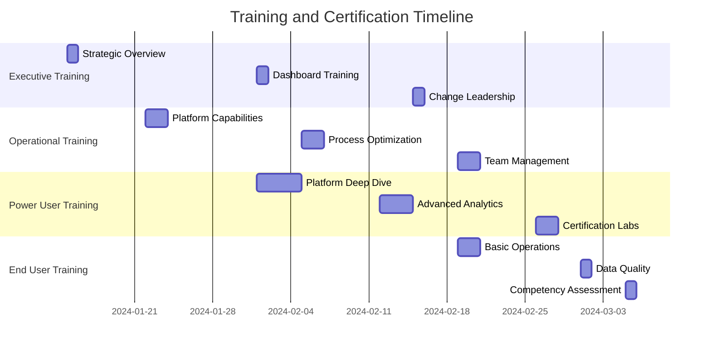

## Executive Summary

Successful data platform transformation requires clear role definition, accountability frameworks, and structured stakeholder engagement. This guide outlines the key roles, responsibilities, and engagement patterns needed to ensure your Amos implementation delivers maximum value with minimal organizational disruption.

<Card title="Why Role Clarity Matters" icon="users">
Fund operations involve multiple stakeholders with different priorities, timelines, and success metrics. Clear role definition prevents conflicts, ensures accountability, and enables effective decision-making throughout the transformation process.
</Card>

## Core Stakeholder Roles

### Fund Leadership Team

<Tabs>
  <Tab title="Chief Operating Officer (COO)">
    **Primary Accountability:** Overall transformation success and operational excellence
    
    **Key Responsibilities:**
    - Provide executive sponsorship and strategic direction
    - Allocate resources and remove organizational obstacles
    - Champion change management and culture transformation
    - Ensure alignment with business objectives and priorities
    - Make final decisions on process changes and investments
    
    **Success Metrics:**
    - Operational efficiency improvements (30-50% reduction in manual processes)
    - Stakeholder satisfaction and adoption rates (>85%)
    - Project timeline and budget adherence
    - Business value realization and ROI achievement
    
    **Time Commitment:** 2-4 hours/week during implementation
    
    **Key Decisions:**
    - Transformation scope and timeline approval
    - Resource allocation and budget decisions
    - Process change authorization
    - Escalation resolution and conflict management
  </Tab>
  
  <Tab title="Chief Financial Officer (CFO)">
    **Primary Accountability:** Financial reporting accuracy and investor relations excellence
    
    **Key Responsibilities:**
    - Ensure financial data accuracy and regulatory compliance
    - Oversee investor reporting transformation and automation
    - Validate business case and ROI projections
    - Manage budget and cost control for implementation
    - Ensure audit readiness and compliance requirements
    
    **Success Metrics:**
    - Financial reporting cycle time reduction (40-60%)
    - Data accuracy improvements (>99.5%)
    - Audit preparation time reduction (50-70%)
    - Investor satisfaction with reporting quality
    
    **Time Commitment:** 3-5 hours/week during financial system integration
    
    **Key Decisions:**
    - Financial data model and calculation logic approval
    - Reporting template and format decisions
    - Compliance and audit requirement validation
    - Investment prioritization and budget allocation
  </Tab>
  
  <Tab title="Chief Investment Officer (CIO)">
    **Primary Accountability:** Investment process optimization and portfolio insights
    
    **Key Responsibilities:**
    - Define investment analytics and reporting requirements
    - Ensure portfolio management system integration
    - Validate investment performance calculations and attribution
    - Champion advanced analytics and AI readiness initiatives
    - Oversee deal pipeline and opportunity management transformation
    
    **Success Metrics:**
    - Investment decision cycle time improvement (20-40%)
    - Portfolio monitoring and reporting automation (>80%)
    - Deal pipeline visibility and conversion tracking
    - Investment performance attribution accuracy
    
    **Time Commitment:** 2-3 hours/week during portfolio system integration
    
    **Key Decisions:**
    - Investment data model and KPI definitions
    - Portfolio analytics and dashboard requirements
    - Deal pipeline process and workflow design
    - Performance attribution methodology validation
  </Tab>
</Tabs>

### Operational Leadership Team

<Tabs>
  <Tab title="Head of Compliance">
    **Primary Accountability:** Regulatory compliance and risk management
    
    **Key Responsibilities:**
    - Ensure regulatory reporting accuracy and timeliness
    - Validate audit trail and data lineage capabilities
    - Oversee compliance monitoring and exception management
    - Manage regulatory change impact and adaptation
    - Ensure data privacy and security compliance
    
    **Success Metrics:**
    - Regulatory reporting automation (>90%)
    - Audit finding reduction (>50%)
    - Compliance monitoring coverage (100%)
    - Risk identification and mitigation effectiveness
    
    **Engagement Pattern:**
    - Weekly during compliance system integration
    - Monthly during ongoing operations
    - Ad-hoc for regulatory changes and audits
    
    **Training Requirements:**
    - Amos compliance monitoring capabilities (4 hours)
    - Audit trail and lineage tools (2 hours)
    - Exception management workflows (2 hours)
  </Tab>
  
  <Tab title="Head of Fund Operations">
    **Primary Accountability:** Operational process efficiency and data quality
    
    **Key Responsibilities:**
    - Lead operational process redesign and optimization
    - Ensure fund administration system integration
    - Manage data quality standards and monitoring
    - Oversee operational reporting and KPI tracking
    - Champion automation and efficiency initiatives
    
    **Success Metrics:**
    - Process cycle time reduction (40-60%)
    - Data quality score improvements (>95%)
    - Operational error reduction (>70%)
    - Team productivity and satisfaction improvements
    
    **Engagement Pattern:**
    - Daily during process redesign phases
    - Weekly during implementation and testing
    - Bi-weekly during steady-state operations
    
    **Training Requirements:**
    - Amos platform administration (8 hours)
    - Data quality management (4 hours)
    - Process automation tools (6 hours)
  </Tab>
  
  <Tab title="Head of Investor Relations">
    **Primary Accountability:** Investor communication and reporting excellence
    
    **Key Responsibilities:**
    - Define investor reporting requirements and formats
    - Ensure investor portal and communication integration
    - Validate investor-facing analytics and dashboards
    - Manage investor feedback and enhancement requests
    - Oversee fundraising data and presentation automation
    
    **Success Metrics:**
    - Investor report generation time reduction (>60%)
    - Investor satisfaction with reporting quality (>90%)
    - Fundraising data preparation efficiency (>50%)
    - Investor query response time improvement
    
    **Engagement Pattern:**
    - Weekly during investor reporting system setup
    - Monthly during template and format development
    - Quarterly for investor feedback and enhancements
    
    **Training Requirements:**
    - Investor reporting tools and templates (4 hours)
    - Dashboard creation and customization (3 hours)
    - Data visualization best practices (2 hours)
  </Tab>
</Tabs>

### Technical and Data Teams

<Tabs>
  <Tab title="Data Owner/Steward">
    **Primary Accountability:** Data governance and quality assurance
    
    **Key Responsibilities:**
    - Define data governance policies and procedures
    - Ensure data quality standards and monitoring
    - Manage data access controls and security
    - Oversee data lineage and documentation
    - Coordinate cross-functional data requirements
    
    **Success Metrics:**
    - Data quality score achievement (>95%)
    - Data governance policy compliance (100%)
    - Data access request resolution time (<24 hours)
    - Data lineage documentation completeness (100%)
    
    **Daily Activities:**
    - Monitor data quality dashboards and alerts
    - Review and approve data access requests
    - Investigate and resolve data quality issues
    - Update data documentation and lineage
    
    **Training Requirements:**
    - Amos data governance framework (6 hours)
    - Data quality monitoring and alerting (4 hours)
    - Access control management (3 hours)
    - Data lineage and documentation tools (3 hours)
  </Tab>
  
  <Tab title="IT/Technical Lead">
    **Primary Accountability:** Technical implementation and system integration
    
    **Key Responsibilities:**
    - Lead technical architecture and integration design
    - Manage system deployments and configurations
    - Ensure security and performance requirements
    - Coordinate with vendors and external systems
    - Provide technical support and troubleshooting
    
    **Success Metrics:**
    - System uptime and availability (>99.5%)
    - Integration success rate (100%)
    - Performance benchmarks achievement
    - Security compliance validation (100%)
    
    **Daily Activities:**
    - Monitor system performance and health
    - Manage deployment and configuration changes
    - Troubleshoot technical issues and incidents
    - Coordinate with external vendors and support
    
    **Training Requirements:**
    - Amos platform architecture (8 hours)
    - System administration and configuration (12 hours)
    - Security and compliance management (4 hours)
    - Troubleshooting and support procedures (6 hours)
  </Tab>
  
  <Tab title="Business Analyst">
    **Primary Accountability:** Requirements gathering and process optimization
    
    **Key Responsibilities:**
    - Gather and document business requirements
    - Design and validate process improvements
    - Create user stories and acceptance criteria
    - Facilitate stakeholder workshops and sessions
    - Manage change requests and enhancements
    
    **Success Metrics:**
    - Requirements completeness and accuracy (>95%)
    - Stakeholder satisfaction with solutions (>85%)
    - Process improvement identification and implementation
    - Change request resolution time (<5 days)
    
    **Daily Activities:**
    - Conduct stakeholder interviews and workshops
    - Document requirements and process flows
    - Validate solutions against business needs
    - Manage change requests and communications
    
    **Training Requirements:**
    - Amos business capabilities overview (4 hours)
    - Requirements gathering methodologies (6 hours)
    - Process mapping and optimization (4 hours)
    - Stakeholder engagement techniques (3 hours)
  </Tab>
</Tabs>

## RACI Matrix by Implementation Phase

### Adapt Phase (Weeks 1-4)

| Activity | COO | CFO | CIO | Compliance | Ops | IR | Data Owner | IT Lead | Bus Analyst |
|----------|-----|-----|-----|------------|-----|----|-----------|---------|-----------| 
| Project Charter | **A** | C | C | C | C | C | I | I | **R** |
| Technical Setup | C | I | I | C | C | I | C | **R** | C |
| Data Integration | C | **A** | **A** | **A** | **A** | **A** | **R** | **R** | C |
| Process Documentation | C | C | C | C | **A** | C | C | C | **R** |
| Stakeholder Communication | **R** | C | C | C | C | C | I | I | C |

### Align Phase (Weeks 5-12)

| Activity | COO | CFO | CIO | Compliance | Ops | IR | Data Owner | IT Lead | Bus Analyst |
|----------|-----|-----|-----|------------|-----|----|-----------|---------|-----------| 
| Governance Framework | **A** | C | C | **R** | C | C | **R** | C | C |
| Process Standardization | **A** | **R** | **R** | **R** | **R** | **R** | C | C | **R** |
| Training Delivery | C | C | C | C | **A** | C | **R** | **R** | **R** |
| Quality Assurance | C | **A** | C | **A** | **A** | C | **R** | **R** | C |

### Upgrade Phase (Weeks 13-24)

| Activity | COO | CFO | CIO | Compliance | Ops | IR | Data Owner | IT Lead | Bus Analyst |
|----------|-----|-----|-----|------------|-----|----|-----------|---------|-----------| 
| Advanced Analytics | C | **A** | **A** | C | C | **A** | **R** | **R** | **R** |
| Process Automation | **A** | C | C | C | **R** | C | C | **R** | **R** |
| Innovation Initiatives | **A** | C | **R** | C | C | C | C | **R** | C |
| Continuous Improvement | **A** | C | C | C | **R** | C | **R** | C | **R** |

**Legend:** R = Responsible, A = Accountable, C = Consulted, I = Informed

## Stakeholder Engagement Framework

### Communication Patterns and Cadence

<CardGroup cols={2}>
  <Card title="Executive Steering Committee" icon="users">
    **Participants:** COO, CFO, CIO, Project Lead
    **Frequency:** Bi-weekly during implementation, monthly during operations
    **Duration:** 60 minutes
    **Agenda:** Progress review, issue escalation, strategic decisions, resource allocation
  </Card>
  
  <Card title="Operational Working Group" icon="cog">
    **Participants:** Ops, Compliance, IR, Data Owner, Business Analyst
    **Frequency:** Weekly during implementation, bi-weekly during operations
    **Duration:** 90 minutes
    **Agenda:** Process design, requirements review, testing coordination, issue resolution
  </Card>
  
  <Card title="Technical Working Group" icon="code">
    **Participants:** IT Lead, Data Owner, External Vendors, Business Analyst
    **Frequency:** Daily during integration, weekly during operations
    **Duration:** 30-60 minutes
    **Agenda:** Technical progress, integration issues, performance monitoring, security updates
  </Card>
  
  <Card title="Change Management Forum" icon="users">
    **Participants:** All stakeholders (rotating participation)
    **Frequency:** Monthly during implementation, quarterly during operations
    **Duration:** 120 minutes
    **Agenda:** Training updates, adoption metrics, feedback collection, success stories
  </Card>
</CardGroup>

### Escalation Procedures

<Steps>
  <Step title="Level 1: Working Group Resolution">
    **Timeframe:** 1-2 business days
    **Scope:** Technical issues, process questions, minor requirement changes
    **Decision Makers:** Working group leads and subject matter experts
  </Step>
  
  <Step title="Level 2: Operational Leadership">
    **Timeframe:** 3-5 business days
    **Scope:** Process conflicts, resource constraints, moderate scope changes
    **Decision Makers:** Department heads and operational leaders
  </Step>
  
  <Step title="Level 3: Executive Steering">
    **Timeframe:** 5-10 business days
    **Scope:** Strategic decisions, major scope changes, budget impacts
    **Decision Makers:** Executive steering committee
  </Step>
  
  <Step title="Level 4: Fund Leadership">
    **Timeframe:** As needed
    **Scope:** Fundamental project direction, major investment decisions
    **Decision Makers:** Fund partners and board
  </Step>
</Steps>

## Training and Development Framework

### Role-Based Training Paths

<Tabs>
  <Tab title="Executive Leadership">
    **Training Objectives:**
    - Understand strategic value and business impact
    - Learn governance and oversight responsibilities
    - Develop change leadership capabilities
    
    **Training Modules:**
    1. Amos Strategic Overview (2 hours)
    2. Executive Dashboard and KPI Review (1 hour)
    3. Change Leadership Best Practices (2 hours)
    4. ROI Measurement and Value Realization (1 hour)
    
    **Delivery Method:** Executive briefings, one-on-one sessions
    **Certification:** Executive readiness assessment
  </Tab>
  
  <Tab title="Operational Leaders">
    **Training Objectives:**
    - Master operational capabilities and workflows
    - Develop team training and support skills
    - Learn performance monitoring and optimization
    
    **Training Modules:**
    1. Amos Operational Capabilities (4 hours)
    2. Process Design and Optimization (3 hours)
    3. Team Training and Change Management (3 hours)
    4. Performance Monitoring and KPIs (2 hours)
    
    **Delivery Method:** Workshops, hands-on labs, peer learning
    **Certification:** Operational leader certification
  </Tab>
  
  <Tab title="Power Users">
    **Training Objectives:**
    - Achieve advanced platform proficiency
    - Develop self-service analytics capabilities
    - Learn troubleshooting and support skills
    
    **Training Modules:**
    1. Amos Platform Deep Dive (8 hours)
    2. Advanced Analytics and Reporting (6 hours)
    3. Data Quality and Governance (4 hours)
    4. User Support and Troubleshooting (3 hours)
    
    **Delivery Method:** Intensive workshops, mentoring, certification labs
    **Certification:** Power user certification with practical assessment
  </Tab>
  
  <Tab title="End Users">
    **Training Objectives:**
    - Learn daily operational procedures
    - Understand data quality responsibilities
    - Develop basic troubleshooting skills
    
    **Training Modules:**
    1. Amos User Interface and Navigation (2 hours)
    2. Daily Operational Procedures (3 hours)
    3. Data Quality and Validation (2 hours)
    4. Basic Troubleshooting and Support (1 hour)
    
    **Delivery Method:** Online modules, group sessions, job aids
    **Certification:** User competency assessment
  </Tab>
</Tabs>

### Training Schedule and Milestones

## Success Metrics and KPIs by Role

### Executive Leadership Metrics

<CardGroup cols={2}>
  <Card title="Strategic Value" icon="chart-line">
    - ROI achievement vs. projections
    - Operational efficiency improvements
    - Competitive advantage indicators
    - Stakeholder satisfaction scores
  </Card>
  
  <Card title="Organizational Health" icon="heart">
    - Change adoption rates
    - Employee engagement scores
    - Training completion rates
    - Culture transformation indicators
  </Card>
</CardGroup>

### Operational Leadership Metrics

<CardGroup cols={2}>
  <Card title="Process Excellence" icon="cog">
    - Process cycle time reductions
    - Error rate improvements
    - Automation adoption rates
    - Quality score achievements
  </Card>
  
  <Card title="Team Performance" icon="users">
    - Team productivity improvements
    - Skill development progress
    - User satisfaction scores
    - Support ticket resolution
  </Card>
</CardGroup>

### Technical Team Metrics

<CardGroup cols={2}>
  <Card title="System Performance" icon="chart-line">
    - System uptime and availability
    - Performance benchmark achievement
    - Integration success rates
    - Security compliance scores
  </Card>
  
  <Card title="Data Quality" icon="database">
    - Data accuracy percentages
    - Data freshness metrics
    - Lineage completeness scores
    - Governance compliance rates
  </Card>
</CardGroup>

## Communication Plans and Templates

### Stakeholder Communication Matrix

| Stakeholder Group | Information Needs | Frequency | Format | Owner |
|------------------|-------------------|-----------|---------|-------|
| **Executive Leadership** | Strategic progress, ROI metrics, major decisions | Bi-weekly | Executive dashboard, brief reports | COO/Project Lead |
| **Operational Teams** | Process changes, training schedules, performance metrics | Weekly | Team meetings, email updates | Department Heads |
| **Technical Teams** | System status, integration progress, technical issues | Daily | Stand-ups, technical dashboards | IT Lead |
| **End Users** | Training announcements, system changes, tips & tricks | As needed | Email, intranet, training sessions | Training Lead |

### Communication Templates

<Accordion>
  <AccordionItem title="Executive Status Report Template">
    **Subject:** Amos Implementation - Executive Update [Week X]
    
    **Executive Summary:**
    - Overall project health: [Green/Yellow/Red]
    - Key accomplishments this period
    - Critical issues requiring attention
    - Upcoming milestones and decisions needed
    
    **Progress Metrics:**
    - Timeline adherence: [X% complete]
    - Budget utilization: [X% of approved budget]
    - Stakeholder satisfaction: [X/10 average score]
    - Risk mitigation status: [X open risks]
    
    **Key Decisions Required:**
    - [Decision 1 with deadline]
    - [Decision 2 with deadline]
    
    **Next Period Focus:**
    - [Priority 1]
    - [Priority 2]
  </AccordionItem>
  
  <AccordionItem title="Team Communication Template">
    **Subject:** Amos Update - [Team Name] [Date]
    
    **This Week's Highlights:**
    - [Achievement 1]
    - [Achievement 2]
    - [Challenge addressed]
    
    **Upcoming Activities:**
    - [Activity 1 with date]
    - [Activity 2 with date]
    - [Training session with details]
    
    **Action Items:**
    - [Action item 1 - Owner - Due date]
    - [Action item 2 - Owner - Due date]
    
    **Questions or Concerns:**
    - Contact [Name] for [specific issues]
    - Escalate to [Manager] for [decision items]
  </AccordionItem>
  
  <AccordionItem title="Change Announcement Template">
    **Subject:** Important Update: [Change Description]
    
    **What's Changing:**
    - [Clear description of the change]
    - [Why this change is being made]
    - [Benefits to users and organization]
    
    **When:**
    - Effective date: [Date]
    - Training available: [Dates and times]
    - Support available: [Contact information]
    
    **What You Need to Do:**
    - [Action 1 with deadline]
    - [Action 2 with deadline]
    - [Training requirement if applicable]
    
    **Getting Help:**
    - Questions: [Contact information]
    - Training: [Schedule and registration]
    - Technical support: [Contact information]
  </AccordionItem>
</Accordion>

<Card title="Ready to Define Your Team Structure?" icon="users">
Successful transformation requires the right people in the right roles with clear accountability. Our change management experts can help you assess your current team, identify gaps, and develop a customized organizational structure for your Amos implementation.

[Schedule a Team Readiness Assessment](/contact) or [Download our Role Definition Toolkit](/resources/role-definition-toolkit)
</Card>