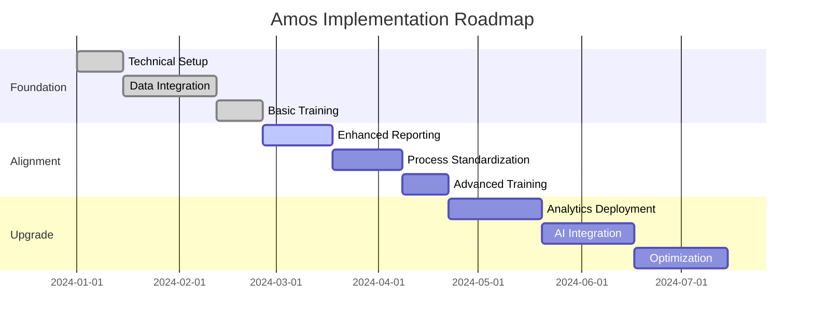

Implementing Amos in your fund operations is a strategic transformation that follows our proven **Adapt → Align → Upgrade** methodology. This approach ensures minimal disruption while maximizing value realization through systematic organizational change.

## Implementation Philosophy

Our implementation approach recognizes that successful data platform adoption requires more than technical integration—it demands organizational alignment, process evolution, and cultural change. The Adapt → Align → Upgrade framework ensures your team maintains operational continuity while building toward transformational outcomes.

<CardGroup cols={3}>
  <Card title="Adapt" icon="arrows-rotate">
    **Weeks 1-8**: Amos adapts to your current processes and systems, providing immediate value without requiring operational changes
  </Card>
  <Card title="Align" icon="users">
    **Weeks 9-16**: Stakeholders align on new workflows, governance, and success metrics as capabilities mature
  </Card>
  <Card title="Upgrade" icon="rocket">
    **Weeks 17+**: Operations upgrade to leverage advanced analytics, automation, and AI-enabled decision support
  </Card>
</CardGroup>

## Project Timeline & Phases

### Phase 1: Foundation & Adaptation (Weeks 1-8)

**Objective**: Establish technical foundation while adapting to existing workflows

**Key Deliverables**:
- Technical infrastructure deployment
- Initial data source connections (2-3 primary systems)
- Basic reporting replication of existing outputs
- Stakeholder training on core platform capabilities

**Success Criteria**:
- All critical data sources connected and validated
- Existing reports reproduced with 99%+ accuracy
- Core team trained and comfortable with platform basics
- No disruption to existing operational workflows

**Governance Activities**:
- Weekly steering committee meetings
- Daily technical standup calls
- Bi-weekly stakeholder progress reviews
- Risk assessment and mitigation planning

### Phase 2: Alignment & Optimization (Weeks 9-16)

**Objective**: Align stakeholders on enhanced workflows and governance frameworks

**Key Deliverables**:
- Enhanced reporting suite with new insights
- Automated data quality monitoring
- Standardized governance processes
- Advanced user training and certification

**Success Criteria**:
- 50% reduction in manual reporting effort
- Automated data quality alerts operational
- All stakeholders certified on new workflows
- Governance framework approved and operational

**Governance Activities**:
- Monthly steering committee reviews
- Weekly operational readiness assessments
- Quarterly business value measurement
- Continuous process optimization workshops

### Phase 3: Upgrade & Innovation (Weeks 17+)

**Objective**: Leverage advanced capabilities for competitive advantage

**Key Deliverables**:
- Advanced analytics and predictive insights
- AI-enabled decision support tools
- Automated regulatory reporting
- Performance optimization and scaling

**Success Criteria**:
- 75% reduction in reporting cycle time
- AI insights integrated into decision workflows
- Regulatory reporting fully automated
- Platform scaled to support growth objectives

**Governance Activities**:
- Quarterly strategic reviews
- Monthly innovation pipeline assessment
- Continuous improvement program
- Success metrics tracking and optimization

## Implementation Roadmap

import { TimelineRoadmap } from '../../components/TimelineRoadmap.mdx'

<TimelineRoadmap />

## Project Governance Framework

### Steering Committee Structure

**Executive Sponsor** (COO/CFO)
- Strategic oversight and resource allocation
- Quarterly business case validation
- Escalation resolution and decision authority

**Project Manager** (Internal or Amos-provided)
- Day-to-day project coordination
- Risk management and issue resolution
- Stakeholder communication and reporting

**Technical Lead** (Fund IT/Data Team)
- Technical architecture decisions
- Integration oversight and validation
- Security and compliance assurance

**Business Champions** (Department Heads)
- Requirements validation and testing
- Change management and user adoption
- Success criteria definition and measurement

### Communication Cadence

| Meeting Type | Frequency | Participants | Purpose |
|--------------|-----------|--------------|---------|
| Steering Committee | Monthly | Executive Sponsor, PM, Tech Lead | Strategic oversight, resource decisions |
| Technical Standup | Weekly | Tech Lead, Amos Engineers | Technical progress, issue resolution |
| Business Review | Bi-weekly | Business Champions, PM | Requirements, testing, adoption |
| All-Hands Update | Monthly | All stakeholders | Progress communication, celebration |

## Risk Management & Mitigation

### Common Implementation Risks

<AccordionGroup>
  <Accordion title="Data Quality Issues">
    **Risk**: Inconsistent or poor quality source data impacts initial results
    
    **Mitigation**: 
    - Comprehensive data profiling in week 1
    - Automated quality monitoring implementation
    - Clear data stewardship responsibilities
    - Iterative quality improvement process
  </Accordion>

  <Accordion title="Stakeholder Resistance">
    **Risk**: Users resist new processes or tools
    
    **Mitigation**:
    - Early stakeholder engagement and input
    - Gradual change introduction (Adapt → Align → Upgrade)
    - Clear communication of benefits and ROI
    - Comprehensive training and support programs
  </Accordion>

  <Accordion title="Integration Complexity">
    **Risk**: Technical integration takes longer than expected
    
    **Mitigation**:
    - Thorough technical assessment before start
    - Phased integration approach (2-3 systems first)
    - Dedicated technical resources and expertise
    - Fallback plans for critical integrations
  </Accordion>

  <Accordion title="Scope Creep">
    **Risk**: Additional requirements emerge during implementation
    
    **Mitigation**:
    - Clear scope definition and change control process
    - Regular requirements validation sessions
    - Phased approach allows for controlled expansion
    - Executive sponsor approval for scope changes
  </Accordion>
</AccordionGroup>

## Success Metrics & KPIs

### Phase 1 Metrics (Foundation)
- **Technical**: 99% data accuracy, 100% uptime, <2 second query response
- **Operational**: Zero disruption to existing workflows, 100% team training completion
- **Business**: Baseline metrics established for future comparison

### Phase 2 Metrics (Alignment)
- **Efficiency**: 50% reduction in manual reporting effort
- **Quality**: 95% automated data quality monitoring coverage
- **Adoption**: 90% user satisfaction scores, 100% workflow compliance

### Phase 3 Metrics (Upgrade)
- **Performance**: 75% faster reporting cycles, 60% faster decision-making
- **Innovation**: 3+ new analytical insights per quarter, AI recommendations accuracy >85%
- **ROI**: Measurable cost savings exceeding implementation investment

## Resource Requirements

### Internal Team Commitment

**Executive Sponsor**: 2-4 hours/week
- Strategic decisions and escalation resolution
- Stakeholder communication and change advocacy

**Project Manager**: 20-30 hours/week (can be Amos-provided)
- Full project coordination and management
- Risk monitoring and issue resolution

**Technical Lead**: 15-20 hours/week
- Technical oversight and integration management
- Security and compliance validation

**Business Champions**: 5-10 hours/week each
- Requirements validation and user acceptance testing
- Team training and change management support

### External Support Options

**Amos Implementation Team**
- Dedicated project manager and technical specialists
- 24/7 support during critical phases
- Best practices guidance and accelerated delivery

**Third-Party Integration Partners**
- Specialized expertise for complex system integrations
- Reduced risk for mission-critical connections
- Faster time-to-value for standard integrations

## Next Steps

Ready to begin your Amos implementation journey? Here's how to get started:

<CardGroup cols={2}>
  <Card title="Assessment & Planning" icon="clipboard-check" href="/fund-leaders/implementation/getting-started">
    Complete our readiness assessment and develop your customized implementation plan
  </Card>
  <Card title="Team Preparation" icon="users-gear" href="/fund-leaders/implementation/team-requirements">
    Understand the skills, roles, and organizational structure needed for success
  </Card>
</CardGroup>

<Card title="Schedule Implementation Consultation" icon="calendar" href="mailto:implementation@amos.com">
  Connect with our implementation specialists to discuss your specific requirements and timeline
</Card>