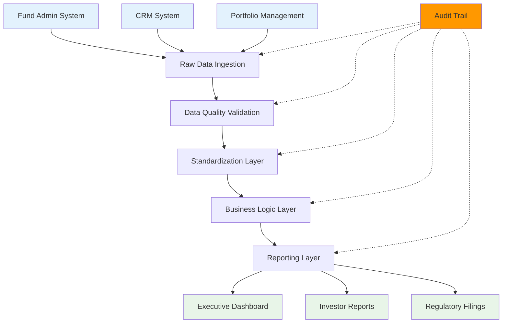
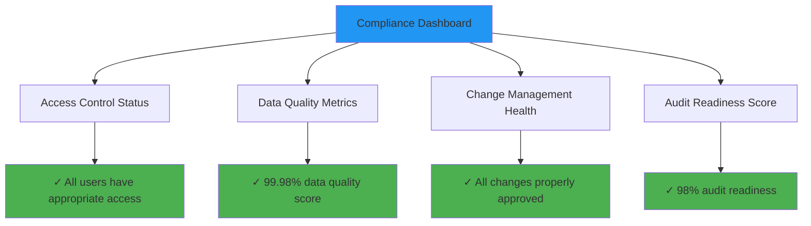

## Complete Transparency for Regulatory Confidence

In the highly regulated fund management industry, auditability isn't optional—it's essential. Amos provides unprecedented transparency through open source practices, version-controlled configurations, and comprehensive audit trails that exceed traditional vendor capabilities.

**Every data transformation, configuration change, and system access is tracked, versioned, and auditable.**

## Version-Controlled Configurations

### Git-Based Configuration Management

All Amos configurations are stored in Git repositories, providing complete change history and accountability:

```yaml
# Example: Fund configuration with full audit trail
fund_configuration:
  version: "2.1.3"
  last_modified: "2024-01-15T10:30:00Z"
  modified_by: "john.doe@examplefund.com"
  approved_by: "jane.smith@examplefund.com"
  
  data_sources:
    fund_admin:
      system: "SS&C Advent"
      connection_type: "API"
      refresh_schedule: "daily_6am"
      data_retention: "7_years"
      
  transformations:
    nav_calculation:
      model: "models/nav/daily_nav.sql"
      version: "1.2.1"
      last_tested: "2024-01-14T15:45:00Z"
      test_results: "all_passed"
```

### Change Audit Trail

Every configuration change creates a permanent audit record:

<CardGroup cols={2}>
  <Card title="Who Changed What" icon="user">
    Complete identity tracking for every modification with digital signatures and approval workflows.
  </Card>
  <Card title="When Changes Occurred" icon="clock">
    Precise timestamps for all changes with timezone and system correlation information.
  </Card>
  <Card title="Why Changes Were Made" icon="message-circle">
    Required change descriptions, ticket references, and business justification documentation.
  </Card>
  <Card title="How Changes Were Tested" icon="check-circle">
    Automated test results and validation evidence before production deployment.
  </Card>
</CardGroup>

## End-to-End Data Lineage

### Complete Data Flow Visibility

Amos automatically tracks data lineage from source systems through all transformations to final reports:



### Lineage Documentation

For every data element in your reports, you can trace:

| Audit Question | Amos Answer | Evidence Location |
|----------------|-------------|-------------------|
| **Where did this data originate?** | Source system, table, and field identification | `lineage/source_mapping.json` |
| **How was it transformed?** | Complete transformation logic and business rules | `models/transformations/*.sql` |
| **When was it last updated?** | Exact refresh timestamps and processing duration | `logs/pipeline_execution.log` |
| **Who approved the logic?** | Code review history and approval signatures | `git log --show-signature` |
| **What tests validated it?** | Automated test results and data quality checks | `tests/results/*.json` |

## Reproducibility & Evidence Packs

### Reproducible Builds

Every Amos deployment and data processing run is completely reproducible:

#### Infrastructure Reproducibility
```hcl
# Terraform state shows exact infrastructure configuration
terraform {
  required_version = "1.6.0"
  
  backend "s3" {
    bucket = "your-fund-terraform-state"
    key    = "amos/production/terraform.tfstate"
    region = "us-east-1"
  }
}

# Exact versions of all components
module "amos_platform" {
  source  = "github.com/amos-platform/terraform-modules?ref=v2.1.3"
  version = "2.1.3"
  
  # Pinned dependency versions
  kubernetes_version = "1.28.4"
  airflow_version   = "2.7.3"
  dbt_version       = "1.6.8"
}
```

#### Data Processing Reproducibility
```yaml
# dbt project configuration with exact versions
name: 'fund_data_platform'
version: '1.2.1'

require-dbt-version: ">=1.6.0,<1.7.0"

# Exact package versions
packages:
  - package: dbt-labs/dbt_utils
    version: 1.1.1
  - git: "https://github.com/amos-platform/fund-models.git"
    revision: "v2.1.3"

# Reproducible seed data and test data
seeds:
  fund_data_platform:
    +materialized: table
    +schema: reference_data
    +meta:
      version: "2024.01.15"
      checksum: "sha256:a1b2c3d4..."
```

### Evidence Packs for Audits

Amos automatically generates comprehensive evidence packs for audits and regulatory reviews:

<CardGroup cols={2}>
  <Card title="Configuration Evidence" icon="settings">
    Complete system configuration with version history, change approvals, and test results.
  </Card>
  <Card title="Data Processing Evidence" icon="database">
    Transformation logic, data quality results, and processing execution logs with timestamps.
  </Card>
  <Card title="Access Control Evidence" icon="shield">
    User access logs, permission changes, and security control validation results.
  </Card>
  <Card title="Change Management Evidence" icon="code">
    Pull request history, code reviews, approval workflows, and deployment records.
  </Card>
</CardGroup>

## Comprehensive Audit Logs

### System Access Logging

Every interaction with the Amos platform is logged with complete context:

```json
{
  "timestamp": "2024-01-15T14:30:15.123Z",
  "event_type": "data_access",
  "user_id": "john.doe@examplefund.com",
  "user_role": "portfolio_analyst",
  "resource": "investor_performance_report",
  "action": "view",
  "ip_address": "10.0.1.45",
  "session_id": "sess_abc123def456",
  "request_id": "req_789xyz012",
  "data_classification": "confidential",
  "success": true,
  "response_time_ms": 245
}
```

### Data Processing Logs

All data transformations include detailed execution logs:

```json
{
  "pipeline_run_id": "run_20240115_143015",
  "model": "nav_calculation",
  "start_time": "2024-01-15T14:30:15Z",
  "end_time": "2024-01-15T14:32:18Z",
  "status": "success",
  "records_processed": 15847,
  "data_quality_checks": {
    "completeness": "100%",
    "accuracy": "99.98%",
    "timeliness": "within_sla"
  },
  "source_data_versions": {
    "fund_admin": "2024-01-15_06:00:00",
    "portfolio_system": "2024-01-15_05:45:00"
  },
  "git_commit": "a1b2c3d4e5f6789",
  "infrastructure_version": "v2.1.3"
}
```

## Regulatory Compliance Support

### SOC 2 Type II Alignment

Amos audit capabilities directly support SOC 2 compliance requirements:

| SOC 2 Criterion | Amos Capability | Evidence Available |
|------------------|-----------------|-------------------|
| **Security** | Access controls, encryption, monitoring | Access logs, security configurations |
| **Availability** | Infrastructure monitoring, disaster recovery | Uptime logs, backup verification |
| **Processing Integrity** | Data quality checks, transformation validation | Test results, processing logs |
| **Confidentiality** | Data classification, access controls | Access logs, encryption evidence |
| **Privacy** | PII handling, data retention policies | Data flow documentation, retention logs |

### LP Due Diligence Requirements

Limited Partners increasingly require detailed operational transparency:

#### Operational Risk Assessment
- **System Architecture**: Complete infrastructure documentation
- **Data Governance**: Policies, procedures, and control evidence
- **Change Management**: Process documentation and execution evidence
- **Business Continuity**: Disaster recovery and backup procedures

#### Data Security & Privacy
- **Encryption Standards**: Implementation evidence and key management
- **Access Controls**: Role definitions, user management, and audit trails
- **Data Retention**: Policy implementation and compliance evidence
- **Incident Response**: Procedures, testing, and response capabilities

### Regulatory Reporting Support

Amos provides audit-ready evidence for various regulatory requirements:

<CardGroup cols={2}>
  <Card title="SEC Compliance" icon="building">
    Form ADV reporting support with complete data lineage and calculation transparency.
  </Card>
  <Card title="AIFMD Reporting" icon="globe">
    European regulatory reporting with full audit trails and data validation evidence.
  </Card>
  <Card title="CFTC Requirements" icon="shield-check">
    Commodity fund reporting with position reconciliation and risk calculation evidence.
  </Card>
  <Card title="Tax Reporting" icon="file-text">
    K-1 and other tax document support with complete calculation audit trails.
  </Card>
</CardGroup>

## Audit Preparation Tools

### Automated Evidence Collection

Amos includes tools to automatically prepare audit evidence packages:

```bash
# Generate comprehensive audit package
amos audit generate \
  --period "2023-01-01,2023-12-31" \
  --scope "nav_calculation,investor_reporting" \
  --format "regulatory_package" \
  --output "/audit/2023_annual_review/"

# Package contents:
# - Configuration history and approvals
# - Data lineage documentation
# - Processing logs and test results
# - Access control evidence
# - Change management records
```

### Audit Trail Queries

Built-in queries for common audit questions:

```sql
-- Who accessed investor data in the last quarter?
SELECT 
  user_id,
  COUNT(*) as access_count,
  MIN(timestamp) as first_access,
  MAX(timestamp) as last_access
FROM audit_logs 
WHERE resource_type = 'investor_data'
  AND timestamp >= '2023-10-01'
GROUP BY user_id;

-- What changes were made to NAV calculations?
SELECT 
  commit_hash,
  author,
  timestamp,
  change_description,
  files_modified
FROM git_audit_log
WHERE file_path LIKE '%nav_calculation%'
  AND timestamp >= '2023-01-01'
ORDER BY timestamp DESC;
```

## Continuous Monitoring & Alerting

### Real-Time Audit Monitoring

Amos continuously monitors for audit-relevant events:

- **Unusual Access Patterns**: Automated detection of anomalous user behavior
- **Configuration Drift**: Alerts when systems deviate from approved configurations
- **Data Quality Issues**: Immediate notification of data integrity problems
- **Security Events**: Real-time alerting for potential security incidents

### Compliance Dashboard

Executive dashboard showing compliance posture in real-time:



## Implementation Best Practices

### Audit-First Design

When implementing Amos, consider audit requirements from day one:

1. **Define Audit Scope**: Identify what needs to be auditable
2. **Configure Logging**: Set up comprehensive audit logging
3. **Establish Procedures**: Create audit evidence collection procedures
4. **Train Teams**: Ensure staff understand audit requirements
5. **Test Regularly**: Conduct mock audits to validate evidence quality

### Evidence Retention Strategy

Develop a comprehensive evidence retention strategy:

- **Configuration History**: Retain indefinitely for regulatory compliance
- **Processing Logs**: 7+ years for most fund regulations
- **Access Logs**: 3-7 years depending on jurisdiction
- **Test Results**: Retain with associated code versions

## Next Steps

<CardGroup cols={3}>
  <Card title="Governance & Compliance" href="/fund-leaders/open-source-assurance/governance">
    Explore governance frameworks and contribution models for open source adoption
  </Card>
  <Card title="Implementation Planning" href="/fund-leaders/implementation/getting-started">
    Start planning your audit-ready Amos deployment
  </Card>
  <Card title="Change Management" href="/fund-leaders/change-management/index">
    Learn how to implement audit controls through the Adapt → Align → Upgrade process
  </Card>
</CardGroup>

---

*Ready to implement audit-ready data operations? [Contact our team](/contact) to discuss your specific compliance and auditability requirements.*