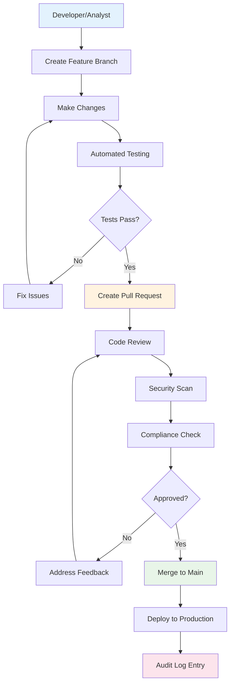
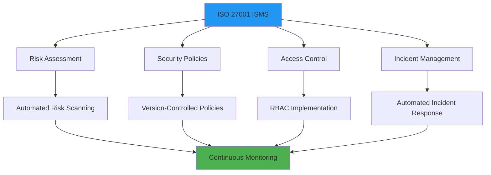
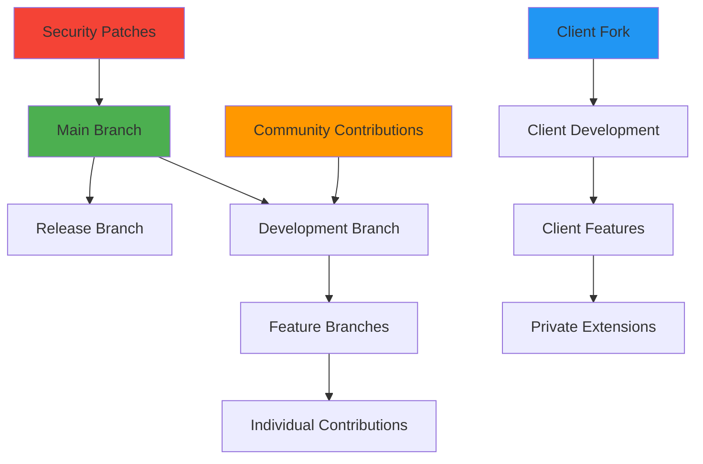

## Enterprise-Grade Governance for Open Source

Open source doesn't mean ungoverned. Amos provides enterprise-grade governance frameworks that exceed traditional vendor capabilities while maintaining the flexibility and transparency that open source enables.

**Every change is controlled, every access is monitored, and every process is auditable.**

## Change Management via Pull Requests

### Git-Based Change Control

All system changes flow through a structured pull request (PR) process that provides complete governance and audit trails:



### Multi-Level Approval Workflows

Different types of changes require different approval levels:

| Change Type | Required Approvals | Example |
|-------------|-------------------|---------|
| **Configuration Updates** | 1 Senior Analyst + 1 Operations | Data source connection strings |
| **Business Logic Changes** | 1 Portfolio Manager + 1 Compliance | NAV calculation modifications |
| **Security Changes** | 1 CISO + 1 CTO | Access control modifications |
| **Infrastructure Changes** | 1 DevOps Lead + 1 CTO | Deployment configuration updates |

### Automated Governance Checks

Every pull request triggers automated governance validation:

```yaml
# Example: Automated governance pipeline
governance_pipeline:
  security_scan:
    - secret_detection
    - vulnerability_scanning
    - license_compliance
    
  compliance_checks:
    - pii_data_handling
    - data_retention_policies
    - access_control_validation
    
  business_validation:
    - calculation_accuracy_tests
    - data_quality_validation
    - performance_impact_assessment
    
  documentation_requirements:
    - change_description_required
    - business_justification_required
    - rollback_plan_documented
```

## Least-Privilege Access Model

### Role-Based Access Control (RBAC)

Amos implements comprehensive RBAC aligned with fund organizational structures:

<CardGroup cols={2}>
  <Card title="Executive Access" icon="user-check">
    Read-only access to executive dashboards and summary reports with full audit logging.
  </Card>
  <Card title="Portfolio Management" icon="chart-line">
    Access to investment data, performance analytics, and portfolio reporting with change approval rights.
  </Card>
  <Card title="Operations Team" icon="cog">
    System configuration access with mandatory peer review and compliance validation.
  </Card>
  <Card title="Compliance Team" icon="shield-check">
    Audit access to all systems with read-only permissions and comprehensive logging.
  </Card>
</CardGroup>

### Dynamic Access Controls

Access permissions are dynamically managed based on context and risk:

```yaml
# Example: Dynamic access policy
access_policy:
  user: "portfolio.analyst@fund.com"
  base_permissions:
    - read_portfolio_data
    - create_analysis_reports
    
  conditional_permissions:
    - permission: "modify_nav_calculations"
      conditions:
        - time_window: "business_hours"
        - approval_required: true
        - dual_control: true
        
    - permission: "access_investor_pii"
      conditions:
        - business_justification: required
        - time_limited: "4_hours"
        - audit_notification: "compliance_team"
```

### Identity Integration

Seamless integration with existing identity management systems:

- **Active Directory/LDAP**: Automatic user provisioning and group synchronization
- **SAML/OIDC**: Single sign-on with multi-factor authentication
- **Privileged Access Management**: Integration with PAM solutions for elevated access
- **Just-in-Time Access**: Temporary elevated permissions with automatic expiration

## SOC 2 & ISO 27001 Mapping

### SOC 2 Type II Compliance Framework

Amos governance directly supports SOC 2 compliance across all trust service criteria:

#### Security (CC6)
| Control | Amos Implementation | Evidence |
|---------|-------------------|----------|
| **Logical Access Controls** | RBAC with MFA and session management | Access logs, permission matrices |
| **Network Security** | VPC isolation, security groups, encryption | Network configurations, traffic logs |
| **Data Protection** | Encryption at rest/transit, key management | Encryption evidence, key rotation logs |

#### Availability (CC7)
| Control | Amos Implementation | Evidence |
|---------|-------------------|----------|
| **System Monitoring** | Real-time monitoring with alerting | Monitoring dashboards, incident logs |
| **Backup & Recovery** | Automated backups with tested recovery | Backup logs, recovery test results |
| **Capacity Management** | Auto-scaling with performance monitoring | Capacity reports, scaling events |

#### Processing Integrity (CC8)
| Control | Amos Implementation | Evidence |
|---------|-------------------|----------|
| **Data Processing Controls** | Automated validation and reconciliation | Processing logs, validation results |
| **Change Management** | PR-based changes with testing | Git history, test results |
| **Error Handling** | Comprehensive error logging and alerting | Error logs, resolution tracking |

### ISO 27001 Information Security Management

Amos aligns with ISO 27001 requirements through systematic security controls:



## Secure SDLC Practices

### Security-First Development

Every aspect of Amos development follows secure SDLC principles:

#### Code Security
- **Static Analysis**: Automated code scanning for vulnerabilities
- **Dependency Scanning**: Regular updates and vulnerability assessment
- **Secret Management**: No hardcoded secrets, encrypted configuration
- **Code Signing**: Digital signatures for all code commits

#### Infrastructure Security
- **Infrastructure as Code**: All infrastructure defined in version-controlled code
- **Security Baselines**: Hardened base images and configurations
- **Network Segmentation**: Micro-segmentation with zero-trust principles
- **Encryption Everywhere**: End-to-end encryption for data and communications

### Continuous Security Monitoring

Real-time security monitoring and response:

```yaml
# Example: Security monitoring configuration
security_monitoring:
  threat_detection:
    - unusual_access_patterns
    - privilege_escalation_attempts
    - data_exfiltration_indicators
    - configuration_drift_detection
    
  automated_response:
    - account_lockout_on_suspicious_activity
    - network_isolation_on_threat_detection
    - incident_escalation_to_security_team
    - evidence_preservation_for_investigation
    
  compliance_monitoring:
    - access_control_violations
    - data_handling_policy_violations
    - change_management_bypasses
    - audit_log_integrity_checks
```

## Contribution Model & Client Autonomy

### Open Source Contribution Framework

Clients can contribute to and extend Amos while maintaining governance:

<CardGroup cols={2}>
  <Card title="Private Extensions" icon="lock">
    Develop fund-specific features in private repositories with full control over intellectual property.
  </Card>
  <Card title="Community Contributions" icon="users">
    Contribute generic improvements back to the community while maintaining competitive advantages.
  </Card>
  <Card title="Custom Connectors" icon="link">
    Build proprietary system connectors with standardized interfaces and governance controls.
  </Card>
  <Card title="Governance Oversight" icon="eye">
    Maintain oversight of all changes through established review and approval processes.
  </Card>
</CardGroup>

### Escalation Model

Clear escalation paths for different types of issues and changes:

#### Technical Issues
1. **Level 1**: Internal team resolution with documentation
2. **Level 2**: Amos community support and knowledge base
3. **Level 3**: Amos engineering team consultation
4. **Level 4**: Emergency support with SLA guarantees

#### Governance Issues
1. **Policy Questions**: Internal compliance team review
2. **Regulatory Concerns**: Legal and compliance escalation
3. **Security Incidents**: CISO and security team involvement
4. **Audit Findings**: Executive leadership and board notification

### Recommended Branching Strategy

Structured branching strategy that supports governance while enabling innovation:



## Compliance Automation

### Automated Compliance Reporting

Amos automatically generates compliance reports and evidence:

```python
# Example: Automated compliance report generation
def generate_compliance_report(period, framework):
    """Generate compliance evidence package"""
    
    evidence = {
        'access_controls': collect_access_evidence(period),
        'change_management': collect_change_evidence(period),
        'data_processing': collect_processing_evidence(period),
        'security_controls': collect_security_evidence(period),
        'audit_trails': collect_audit_evidence(period)
    }
    
    report = ComplianceReport(
        framework=framework,  # SOC2, ISO27001, etc.
        period=period,
        evidence=evidence,
        attestations=collect_attestations()
    )
    
    return report.generate_package()
```

### Continuous Compliance Monitoring

Real-time compliance posture monitoring:

| Compliance Area | Monitoring Frequency | Alert Threshold | Remediation SLA |
|-----------------|---------------------|-----------------|-----------------|
| **Access Controls** | Real-time | Any violation | 15 minutes |
| **Data Quality** | Every pipeline run | >1% degradation | 1 hour |
| **Change Management** | Every commit | Unapproved changes | Immediate |
| **Security Controls** | Continuous | Any security event | 5 minutes |

## Implementation Roadmap

### Phase 1: Foundation (Months 1-3)
- Implement basic RBAC and access controls
- Establish PR-based change management
- Set up audit logging and monitoring
- Configure compliance reporting

### Phase 2: Enhancement (Months 3-6)
- Implement advanced security controls
- Establish automated compliance monitoring
- Integrate with existing identity systems
- Develop custom governance policies

### Phase 3: Optimization (Months 6-12)
- Fine-tune access controls and policies
- Implement advanced threat detection
- Establish continuous compliance monitoring
- Optimize governance workflows

### Success Metrics

Track governance effectiveness through key metrics:

- **Access Control Effectiveness**: Zero unauthorized access incidents
- **Change Management Compliance**: 100% of changes follow PR process
- **Audit Readiness**: <24 hours to produce compliance evidence
- **Security Posture**: Zero critical security findings
- **Compliance Score**: >95% automated compliance validation

## Next Steps

<CardGroup cols={3}>
  <Card title="Open Source Assurance Overview" href="/fund-leaders/open-source-assurance/index">
    Return to the open source assurance overview for a complete picture
  </Card>
  <Card title="Implementation Planning" href="/fund-leaders/implementation/getting-started">
    Start planning your governance-ready Amos deployment
  </Card>
  <Card title="Change Management" href="/fund-leaders/change-management/index">
    Learn how governance integrates with the Adapt → Align → Upgrade methodology
  </Card>
</CardGroup>

---

*Ready to implement enterprise-grade governance for your open source data platform? [Contact our team](/contact) to discuss your specific governance and compliance requirements.*