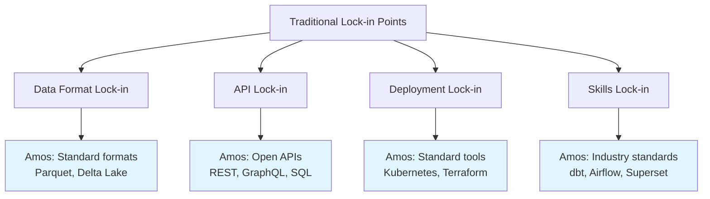
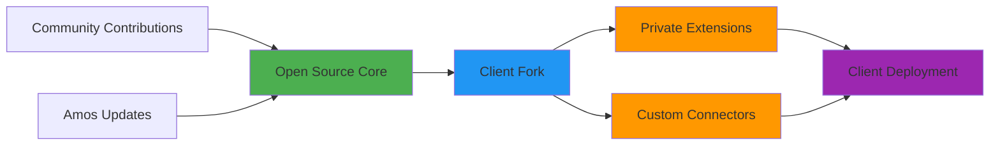

## Openness in Practice

Amos delivers **true control** over your fund's data platform through strategic open source components and transparent practices. Unlike traditional vendors who create dependency through proprietary systems, Amos ensures you maintain ownership and control of your data infrastructure.

<CardGroup cols={2}>
  <Card title="Source Code Control" icon="code">
    Critical components are open source, giving you full visibility and control over your data platform's core functionality.
  </Card>
  <Card title="No Vendor Lock-in" icon="key">
    Standard tooling and reversible deployment ensure you're never trapped by proprietary dependencies.
  </Card>
  <Card title="Full Auditability" icon="search">
    Version-controlled configurations and end-to-end lineage provide complete transparency for regulatory compliance.
  </Card>
  <Card title="Future Optionality" icon="trending-up">
    Open architecture preserves your ability to adapt, extend, or migrate as your needs evolve.
  </Card>
</CardGroup>

## What Components Are Open

Amos strategically open sources the components that matter most for client control and long-term flexibility:

### Data Connectors & Pipelines
- **Source Code Location**: [GitHub - Amos Connectors](https://github.com/amos-platform/connectors)
- **Client Control**: Full source code access, ability to modify and extend
- **What's Included**: All fund administration, CRM, and portfolio management system connectors

### Deployment Infrastructure as Code (IaC)
- **Source Code Location**: [GitHub - Amos Deploy](https://github.com/amos-platform/deploy)
- **Client Control**: Complete deployment automation, infrastructure definitions
- **What's Included**: Terraform modules, Kubernetes manifests, CI/CD pipelines

### Data Models & Transformations
- **Source Code Location**: [GitHub - Amos Core Models](https://github.com/amos-platform/core-models)
- **Client Control**: Full dbt model definitions, transformation logic
- **What's Included**: Canonical data model, business logic, data quality tests

### Example Implementations
- **Source Code Location**: [GitHub - Amos Examples](https://github.com/amos-platform/examples)
- **Client Control**: Reference implementations for common use cases
- **What's Included**: Sample dashboards, report templates, integration patterns

## Lock-in Surface Areas & Mitigation

Traditional data platforms create dependency through multiple lock-in mechanisms. Amos systematically addresses each:



### Data Custody & Retention
- **Your Control**: Data remains in your cloud environment (AWS, Azure, GCP)
- **Standard Formats**: All data stored in open formats (Parquet, Delta Lake)
- **Export Capabilities**: Full data export available at any time
- **Retention Policies**: You control data lifecycle and retention

### Deployment Flexibility
- **Self-Hosting Options**: Deploy in your own cloud environment
- **Standard Tooling**: Uses Kubernetes, Terraform, and other industry standards
- **Reversible Deployment**: Infrastructure can be modified or removed without vendor dependency
- **Multi-Cloud Support**: Not tied to any specific cloud provider

## Client Control Mechanisms

### Version-Controlled Configurations
All system configurations are stored in Git repositories under your control:

```yaml
# Example: Fund-specific configuration
fund_config:
  name: "Example Fund LP"
  data_sources:
    - type: "fund_admin"
      system: "SS&C Advent"
      connection: "encrypted_connection_string"
    - type: "crm"
      system: "Salesforce"
      connection: "oauth_credentials"
  
  data_governance:
    pii_handling: "encrypt_at_rest"
    retention_policy: "7_years"
    access_controls: "rbac_enabled"
```

### Change Management via Pull Requests
- All configuration changes go through PR review process
- Automated testing validates changes before deployment
- Full audit trail of who changed what and when
- Rollback capabilities for any configuration change

### Least-Privilege Access Model
- Role-based access controls (RBAC) for all system components
- Principle of least privilege enforced at infrastructure level
- Audit logs for all access and changes
- Integration with your existing identity management systems

## Regulatory & Compliance Benefits

### SOC 2 & ISO 27001 Alignment
The open source approach directly supports compliance frameworks:

| Control Area | Traditional Vendor | Amos Open Source |
|--------------|-------------------|------------------|
| **Access Controls** | Black box, trust vendor | Full visibility, your controls |
| **Change Management** | Vendor-controlled | PR-based, auditable |
| **Data Processing** | Proprietary algorithms | Open source, reviewable |
| **Incident Response** | Vendor dependency | Direct control and response |
| **Audit Evidence** | Vendor reports | Direct system evidence |

### LP Due Diligence Support
Limited Partners increasingly require transparency into fund operations:

- **Code Review Access**: LPs can review data processing logic
- **Security Posture**: Open source enables independent security assessment
- **Operational Resilience**: No single vendor dependency reduces operational risk
- **Data Governance**: Full transparency into data handling practices

## Secure SDLC Practices

### Development Security
- **Code Scanning**: Automated security scanning on all commits
- **Dependency Management**: Regular updates and vulnerability scanning
- **Secure Defaults**: Security-first configuration templates
- **Penetration Testing**: Regular third-party security assessments

### Contribution Model
While core components are open source, client-specific extensions remain private:



## Getting Started with Open Source Assurance

### Assessment Questions
Before implementation, consider these key questions:

1. **Control Requirements**: What level of source code access do you need?
2. **Compliance Needs**: Which regulatory frameworks must you satisfy?
3. **Internal Capabilities**: Do you have teams to manage open source components?
4. **Risk Tolerance**: How important is vendor independence to your strategy?

### Implementation Approach
1. **Start with Standard Deployment**: Begin with Amos-managed deployment
2. **Gradual Control Transfer**: Progressively take control of components as needed
3. **Skills Development**: Train internal teams on open source components
4. **Full Independence**: Achieve complete self-hosting when ready

## Next Steps

<CardGroup cols={3}>
  <Card title="Vendor Lock-in Prevention" href="/fund-leaders/open-source-assurance/vendor-lock-in">
    Learn how Amos eliminates traditional vendor dependencies
  </Card>
  <Card title="Auditability & Traceability" href="/fund-leaders/open-source-assurance/auditability">
    Understand compliance and audit capabilities
  </Card>
  <Card title="Governance & Compliance" href="/fund-leaders/open-source-assurance/governance">
    Explore governance frameworks and contribution models
  </Card>
</CardGroup>

---

*Ready to explore how open source assurance can benefit your fund? [Contact our team](/contact) to discuss your specific control and compliance requirements.*