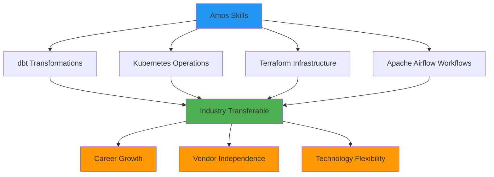
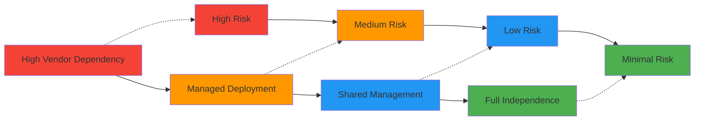

## The Hidden Costs of Vendor Dependency

Traditional data platform vendors create dependency through proprietary formats, custom APIs, and closed deployment models. These dependencies become expensive switching costs that limit your strategic options and negotiating power.

**Amos takes the opposite approach**: Every architectural decision prioritizes your long-term independence and control.

## Self-Hosting Options

### Complete Infrastructure Control

Unlike SaaS-only vendors, Amos provides multiple deployment options that put you in control:

<CardGroup cols={2}>
  <Card title="Your Cloud Environment" icon="cloud">
    Deploy Amos entirely within your AWS, Azure, or GCP environment using your accounts and security policies.
  </Card>
  <Card title="On-Premises Deployment" icon="building">
    Run Amos on your own hardware for maximum control and compliance with data residency requirements.
  </Card>
  <Card title="Hybrid Architecture" icon="globe">
    Combine cloud and on-premises components based on your specific security and performance needs.
  </Card>
  <Card title="Multi-Cloud Strategy" icon="globe">
    Deploy across multiple cloud providers to avoid cloud vendor lock-in and improve resilience.
  </Card>
</CardGroup>

### Infrastructure as Code (IaC)

All Amos deployments use standard Infrastructure as Code practices:

```hcl
# Example Terraform configuration for Amos deployment
module "amos_platform" {
  source = "github.com/amos-platform/terraform-modules"
  
  # Your environment configuration
  environment     = "production"
  region         = "us-east-1"
  vpc_id         = var.your_vpc_id
  
  # Data storage configuration
  data_lake_bucket = var.your_s3_bucket
  database_config  = var.your_rds_config
  
  # Security configuration
  kms_key_id      = var.your_kms_key
  security_groups = var.your_security_groups
  
  # Scaling configuration
  min_nodes = 2
  max_nodes = 10
}
```

**Key Benefits:**
- **Version Controlled**: All infrastructure changes tracked in Git
- **Reproducible**: Identical deployments across environments
- **Portable**: Move between cloud providers or on-premises
- **Auditable**: Complete history of infrastructure changes

## Standard Tooling Approach

### Industry-Standard Components

Amos builds on proven, open-source technologies rather than proprietary alternatives:

| Function | Standard Tool | Proprietary Alternative | Amos Advantage |
|----------|---------------|------------------------|----------------|
| **Orchestration** | Apache Airflow | Vendor-specific workflow engines | Portable workflows, large community |
| **Data Processing** | Apache Spark, dbt | Proprietary transformation engines | Skills transferability, ecosystem |
| **Storage** | Delta Lake, Parquet | Proprietary formats | Open standards, tool compatibility |
| **Visualization** | Apache Superset, Grafana | Vendor-locked dashboards | Flexible reporting, no licensing fees |
| **Container Platform** | Kubernetes | Vendor-specific platforms | Cloud-agnostic, industry standard |

### Skills Transferability

Your team's investment in Amos translates to valuable, portable skills:



## Reversible Deployment

### Exit Strategy Built-In

Every Amos deployment includes mechanisms for complete data and configuration export:

#### Data Portability
- **Standard Formats**: All data stored in Parquet, Delta Lake, or CSV formats
- **Complete Export**: Full data lake export capabilities with metadata preservation
- **Schema Documentation**: Comprehensive data dictionary and lineage information
- **API Access**: Standard SQL and REST APIs for data extraction

#### Configuration Portability
- **Infrastructure Code**: Complete Terraform and Kubernetes configurations
- **Transformation Logic**: All dbt models and business logic in standard SQL
- **Dashboard Definitions**: Exportable dashboard and report configurations
- **Integration Patterns**: Documented APIs and connection specifications

### Migration Support

If you ever need to migrate away from Amos, we provide:

1. **Data Export Services**: Comprehensive data extraction and validation
2. **Documentation Package**: Complete technical documentation for new vendor
3. **Transition Support**: Limited consulting to ensure smooth migration
4. **No Penalties**: No contractual barriers to migration

## Data Custody Retention

### Your Data, Your Control

Unlike vendors who commingle client data, Amos ensures complete data custody:

<CardGroup cols={2}>
  <Card title="Isolated Environments" icon="shield">
    Each client deployment is completely isolated with dedicated infrastructure and encryption keys.
  </Card>
  <Card title="Encryption Key Management" icon="key">
    You control encryption keys through your cloud provider's key management service (KMS).
  </Card>
  <Card title="Access Controls" icon="lock">
    All access controls managed through your identity provider and security policies.
  </Card>
  <Card title="Data Residency" icon="globe">
    Data never leaves your specified geographic regions or compliance boundaries.
  </Card>
</CardGroup>

### Compliance Benefits

This approach directly supports regulatory requirements:

| Regulation | Traditional Vendor Risk | Amos Advantage |
|------------|------------------------|----------------|
| **GDPR** | Vendor controls data processing | Direct control over EU data |
| **SOX** | Dependency on vendor controls | Your controls, your audit |
| **PCI DSS** | Shared responsibility complexity | Clear data custody boundaries |
| **Industry Regulations** | Vendor compliance dependency | Direct regulatory relationship |

## Comparison Framework

### Evaluating Vendor Independence

Use this framework to assess any data platform vendor:

#### Data Control Questions
- [ ] Can you export all data in standard formats?
- [ ] Do you control encryption keys?
- [ ] Can you audit all data processing logic?
- [ ] Is data stored in your cloud environment?

#### Technology Independence Questions
- [ ] Are core components based on open standards?
- [ ] Can you modify or extend the platform?
- [ ] Do you have access to source code for critical components?
- [ ] Can you deploy without vendor involvement?

#### Commercial Independence Questions
- [ ] Are there penalties for migration?
- [ ] Can you negotiate based on alternatives?
- [ ] Do you have leverage in contract renewals?
- [ ] Can you change deployment models?

### Amos vs. Traditional Vendors

| Aspect | Traditional SaaS | Amos Platform |
|--------|------------------|---------------|
| **Data Location** | Vendor's multi-tenant environment | Your dedicated cloud environment |
| **Source Code** | Proprietary, no access | Core components open source |
| **Deployment** | Vendor-controlled SaaS only | Self-hosted, managed, or hybrid |
| **Data Export** | Limited, proprietary formats | Complete, standard formats |
| **Customization** | Configuration only | Full source code modification |
| **Migration** | Complex, expensive | Supported, reversible |
| **Negotiating Power** | Limited (high switching costs) | Strong (low switching costs) |

## Implementation Strategy

### Gradual Independence Approach

You don't need to start with full self-hosting. Amos supports a gradual transition:

#### Phase 1: Managed Deployment (Months 1-6)
- Amos manages infrastructure in your cloud environment
- You retain data custody and access controls
- Learn platform operations with Amos support

#### Phase 2: Shared Management (Months 6-12)
- Take control of specific components (monitoring, backups)
- Amos provides guidance and best practices
- Build internal operational capabilities

#### Phase 3: Full Independence (Year 2+)
- Complete self-hosting with Amos consulting support
- Internal team manages all operations
- Amos provides updates and security patches only

### Risk Mitigation

Each phase reduces vendor dependency while maintaining operational stability:



## Cost Implications

### Total Cost of Ownership

Vendor independence affects long-term costs:

#### Traditional Vendor Costs
- **Licensing Fees**: Ongoing, often increasing annually
- **Professional Services**: Required for customizations
- **Migration Costs**: High switching costs create pricing power
- **Opportunity Costs**: Limited negotiating leverage

#### Amos Open Source Costs
- **Infrastructure**: Your cloud costs (transparent, optimizable)
- **Support**: Optional support contracts (competitive market)
- **Internal Resources**: Investment in team capabilities
- **Flexibility Value**: Preserved options and negotiating power

### ROI of Independence

The investment in vendor independence typically pays for itself through:

1. **Negotiating Power**: Ability to evaluate alternatives
2. **Operational Efficiency**: Direct control over performance optimization
3. **Innovation Speed**: No vendor roadmap dependencies
4. **Risk Reduction**: Elimination of vendor concentration risk

## Next Steps

<CardGroup cols={3}>
  <Card title="Auditability & Traceability" href="/fund-leaders/open-source-assurance/auditability">
    Learn how open source enables complete audit trails and compliance
  </Card>
  <Card title="Governance & Compliance" href="/fund-leaders/open-source-assurance/governance">
    Explore governance frameworks for open source adoption
  </Card>
  <Card title="Implementation Planning" href="/fund-leaders/implementation/getting-started">
    Start planning your vendor-independent deployment
  </Card>
</CardGroup>

---

*Ready to eliminate vendor lock-in from your data platform? [Contact our team](/contact) to discuss your independence strategy and deployment options.*