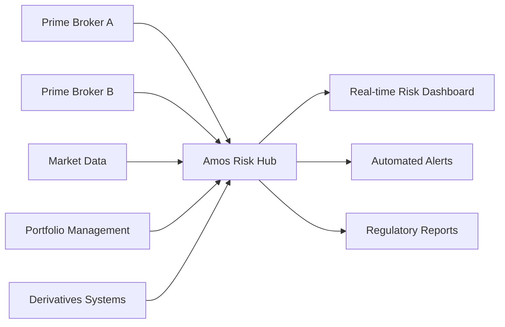
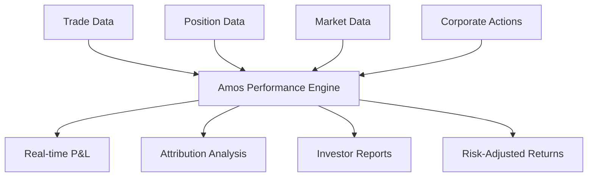
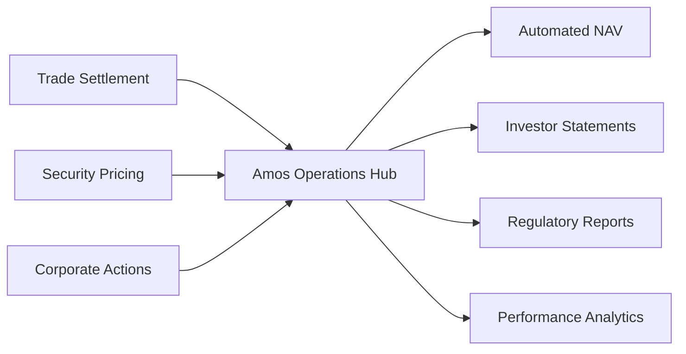

Hedge funds operate in highly regulated environments where real-time risk management, precise performance attribution, and comprehensive regulatory reporting are critical to success. Amos transforms hedge fund operations by providing unified data infrastructure that supports sophisticated analytics while maintaining the compliance and audit capabilities that regulators require.

## Key Hedge Fund Operational Challenges

<CardGroup cols={2}>
  <Card title="Risk Management" icon="shield">
    Real-time monitoring of portfolio risk across multiple strategies, asset classes, and geographic regions with regulatory compliance.
  </Card>
  
  <Card title="Performance Attribution" icon="chart-line">
    Precise calculation of returns by strategy, sector, and security with daily reconciliation and investor-level reporting.
  </Card>
  
  <Card title="Regulatory Reporting" icon="file-text">
    Complex regulatory requirements including Form PF, CFTC reporting, and prime broker reconciliation with audit trails.
  </Card>
  
  <Card title="Operational Efficiency" icon="cog">
    Streamlining trade settlement, NAV calculation, and investor communications while maintaining operational resilience.
  </Card>
</CardGroup>

## Scenario 1: Real-Time Risk Management & Monitoring

### The Challenge
A multi-strategy hedge fund with $3B AUM was struggling with fragmented risk systems across equity long/short, fixed income, and derivatives strategies. Risk calculations were performed end-of-day, limiting the ability to respond to intraday market movements and regulatory requirements for real-time monitoring.

### Amos Solution Implementation

#### Adapt Phase: Integrate Risk Data Sources

- **Week 1-2**: Connect to prime brokers and portfolio management systems
- **Week 3-4**: Integrate market data feeds and derivatives pricing systems
- **Outcome**: Unified risk view across all strategies and asset classes

#### Align Phase: Standardize Risk Framework
- **Risk Metrics**: Consistent VaR, stress testing, and scenario analysis across strategies
- **Limit Management**: Automated monitoring of position limits and risk budgets
- **Escalation Procedures**: Standardized alert systems and response protocols

#### Upgrade Phase: Advanced Risk Analytics
- **Predictive Risk Models**: ML-powered risk forecasting and scenario analysis
- **Cross-Strategy Correlation**: Dynamic correlation analysis and portfolio optimization
- **Regulatory Compliance**: Automated regulatory risk reporting and stress testing

### Risk Management Results

<CardGroup cols={3}>
  <Card title="Risk Visibility" icon="eye">
    **Real-time monitoring** across $3B+ portfolio with sub-second updates
  </Card>
  
  <Card title="Response Time" icon="clock">
    **95% faster** risk alert response from hours to minutes
  </Card>
  
  <Card title="Regulatory Compliance" icon="shield-check">
    **100% compliance** with real-time risk monitoring requirements
  </Card>
</CardGroup>

## Scenario 2: Performance Attribution & Analytics

### The Challenge
A quantitative hedge fund needed precise performance attribution across 15+ strategies with daily investor reporting requirements. Manual reconciliation between portfolio systems and prime brokers was taking 2-3 hours daily and creating accuracy issues.

### Amos Solution: Automated Performance Engine

#### Current State: Manual Performance Calculation
- **Data Collection**: Manual download from multiple prime brokers and systems
- **Reconciliation**: Excel-based matching with frequent discrepancies
- **Attribution**: Strategy-level analysis with limited drill-down capabilities
- **Reporting**: Static reports with 24-48 hour delays

#### Amos Transformation: Real-time Performance Attribution

**Performance Features:**
1. **Real-time P&L**: Continuous calculation with intraday updates
2. **Multi-level Attribution**: Strategy, sector, security, and factor-based analysis
3. **Automated Reconciliation**: Continuous matching with prime broker data
4. **Custom Reporting**: Investor-specific performance presentations

### Performance Attribution Outcomes

| Metric | Before Amos | After Amos | Improvement |
|--------|-------------|------------|-------------|
| **Daily P&L Calculation** | 2-3 hours | Real-time | 100% automation |
| **Reconciliation Accuracy** | 85% (manual errors) | 99.5% (automated) | 14.5% improvement |
| **Attribution Granularity** | Strategy level | Security level | Enhanced detail |
| **Investor Reporting** | Next day | Same day | 24-hour improvement |

## Scenario 3: Regulatory Reporting & Compliance

### The Challenge
A systematic trading fund faced increasing regulatory complexity with Form PF, CFTC position reporting, and European AIFMD requirements. Manual preparation of regulatory reports was consuming 40+ hours per month and creating compliance risks.

### Amos Solution: Automated Regulatory Compliance

#### Regulatory Reporting Framework

**Comprehensive Compliance Coverage:**
- **Form PF**: Automated quarterly and annual reporting with complete audit trails
- **CFTC Reporting**: Daily position reporting with real-time validation
- **AIFMD**: European regulatory requirements with multi-currency support
- **Prime Broker Reconciliation**: Continuous matching and exception reporting

#### Compliance Automation Features

<CardGroup cols={2}>
  <Card title="Automated Report Generation" icon="file-text">
    - Template-driven regulatory reports
    - Real-time data validation and error checking
    - Automated submission workflows
    - Complete audit trail documentation
  </Card>
  
  <Card title="Continuous Monitoring" icon="eye">
    - Real-time compliance monitoring
    - Automated exception alerts
    - Regulatory change tracking
    - Proactive compliance management
  </Card>
</CardGroup>

#### Regulatory Compliance Results

<CardGroup cols={3}>
  <Card title="Reporting Efficiency" icon="clock">
    **90% reduction** in regulatory reporting preparation time
  </Card>
  
  <Card title="Compliance Accuracy" icon="check-circle">
    **Zero regulatory findings** in last 18 months of examinations
  </Card>
  
  <Card title="Audit Readiness" icon="shield">
    **Continuous audit trail** with complete data lineage
  </Card>
</CardGroup>

## Scenario 4: Operational Efficiency & NAV Calculation

### The Challenge
A credit-focused hedge fund was spending significant resources on daily NAV calculation and investor communications, with manual processes creating operational risk and limiting scalability.

### Amos Solution: Automated Operations Platform

#### NAV Calculation Automation
- **Real-time Pricing**: Automated security pricing with multiple data sources
- **Corporate Actions**: Automated processing of dividends, splits, and other events
- **Expense Allocation**: Automated management fee and expense calculations
- **Investor Accounting**: Real-time investor-level NAV and performance tracking

#### Operational Workflow Enhancement

### Operational Efficiency Results

| Process | Before Amos | After Amos | Improvement |
|---------|-------------|------------|-------------|
| **NAV Calculation** | 3-4 hours daily | 30 minutes | 85% reduction |
| **Investor Statements** | Weekly manual | Daily automated | 7x frequency |
| **Operational Errors** | 2-3 per month | <1 per quarter | 90% reduction |
| **Scalability** | Limited by manual processes | Unlimited automation | Infinite scaling |

## Hedge Fund-Specific Amos Features

### Risk Management Suite
- **Real-time Risk Monitoring**: Continuous VaR, stress testing, and scenario analysis
- **Multi-Asset Coverage**: Equities, fixed income, derivatives, and alternative investments
- **Regulatory Compliance**: Automated risk reporting and limit monitoring

### Performance Analytics Platform
- **Real-time Attribution**: Multi-level performance analysis with factor decomposition
- **Benchmark Analysis**: Comprehensive comparison against indices and peer funds
- **Risk-Adjusted Returns**: Sharpe ratio, Sortino ratio, and custom risk metrics

### Regulatory Compliance Hub
- **Automated Reporting**: Form PF, CFTC, AIFMD, and other regulatory requirements
- **Audit Trail Management**: Complete data lineage and change tracking
- **Exception Management**: Automated identification and resolution of compliance issues

### Operations Automation
- **NAV Calculation**: Real-time net asset value calculation with investor-level detail
- **Trade Settlement**: Automated trade matching and settlement monitoring
- **Investor Communications**: Automated statements, reports, and correspondence

## Implementation Roadmap for Hedge Funds

### Phase 1: Risk & Performance Foundation (Months 1-2)
- Integrate prime broker and portfolio management systems
- Implement real-time risk monitoring and performance calculation
- Establish regulatory reporting automation

### Phase 2: Advanced Analytics (Months 3-4)
- Deploy sophisticated risk models and stress testing capabilities
- Enhance performance attribution with factor analysis
- Implement predictive analytics and portfolio optimization

### Phase 3: Full Automation (Months 5-6)
- Enable complete operational automation including NAV calculation
- Deploy AI-powered risk management and alpha generation insights
- Implement advanced regulatory compliance and audit readiness

## ROI Analysis for Hedge Funds

### Operational Cost Savings
- **Risk Management**: 70% reduction in risk management operational costs
- **Performance Reporting**: 85% decrease in daily performance calculation time
- **Regulatory Compliance**: 90% reduction in regulatory reporting preparation

### Revenue Enhancement Opportunities
- **Alpha Generation**: 5-15 basis points improvement through better risk management
- **Operational Alpha**: 10-25 basis points from reduced operational drag
- **Capacity Expansion**: Ability to manage 2-3x AUM with same operational team

### Risk Mitigation Benefits
- **Regulatory Risk**: Significant reduction in compliance violations and fines
- **Operational Risk**: 90% decrease in manual errors and operational failures
- **Reputational Risk**: Enhanced investor confidence through operational excellence

## Hedge Fund Strategy Considerations

### Long/Short Equity
- **Focus**: Real-time risk monitoring and performance attribution
- **Key Benefits**: Enhanced alpha generation and risk management
- **Implementation**: 2-3 month rollout with emphasis on equity analytics

### Multi-Strategy
- **Focus**: Cross-strategy risk management and allocation optimization
- **Key Benefits**: Improved capital allocation and risk-adjusted returns
- **Implementation**: 4-6 month rollout with comprehensive integration

### Quantitative/Systematic
- **Focus**: High-frequency data processing and automated decision support
- **Key Benefits**: Enhanced model performance and operational efficiency
- **Implementation**: 3-4 month rollout with custom analytics integration

### Credit/Fixed Income
- **Focus**: Credit risk monitoring and regulatory compliance
- **Key Benefits**: Improved risk management and operational efficiency
- **Implementation**: 3-5 month rollout with fixed income specialization

## Getting Started

<Card title="Hedge Fund Assessment" icon="clipboard-check" href="/fund-leaders/implementation/getting-started">
  Complete our hedge fund-specific readiness assessment to identify your operational priorities and expected ROI.
</Card>

## Success Stories

Learn from hedge funds that have transformed their operations:

<CardGroup cols={2}>
  <Card title="Multi-Strategy Fund" icon="building" href="/fund-leaders/success-stories/case-study-1">
    $2B fund achieved 95% automation in risk management and regulatory reporting.
  </Card>
  
  <Card title="Quantitative Fund" icon="calculator" href="/fund-leaders/success-stories/case-study-2">
    $5B systematic fund improved operational efficiency by 80% and enhanced alpha generation.
  </Card>
</CardGroup>

## AI Readiness for Hedge Funds

Hedge funds are uniquely positioned to leverage AI for competitive advantage:

### Alpha Generation
- **Signal Discovery**: ML-powered identification of new alpha sources
- **Portfolio Optimization**: AI-driven position sizing and risk budgeting
- **Market Regime Detection**: Automated identification of market condition changes

### Risk Management Enhancement
- **Predictive Risk Models**: AI-powered forecasting of portfolio risk
- **Stress Testing**: Dynamic scenario generation and impact analysis
- **Correlation Modeling**: Real-time correlation analysis and regime detection

### Operational Intelligence
- **Trade Execution Optimization**: AI-powered execution algorithms
- **Operational Anomaly Detection**: Automated identification of operational issues
- **Regulatory Intelligence**: AI-assisted regulatory change monitoring

The hedge fund industry's quantitative nature and regulatory requirements make it an ideal candidate for AI enhancement, and Amos provides the unified, high-quality data foundation necessary for successful AI implementations.

Ready to optimize your hedge fund operations? Explore our [implementation guide](/fund-leaders/implementation/getting-started) or [schedule a consultation](/contact) to discuss your specific requirements and regulatory considerations.