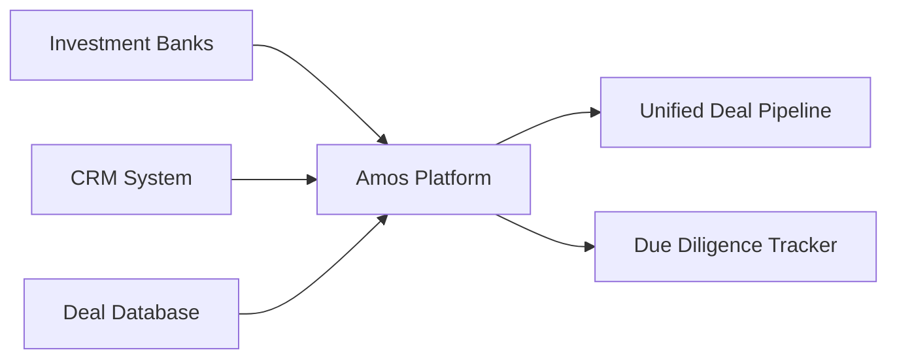
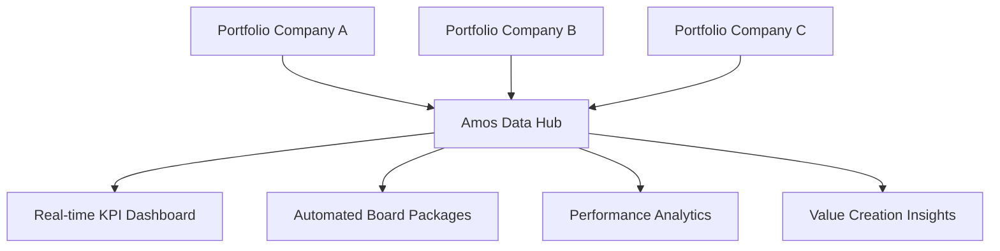

Private equity funds face unique operational challenges around deal execution, portfolio company management, and LP reporting. Amos transforms these operations through intelligent automation while maintaining the control and auditability that PE funds require.

## Key PE Operational Challenges

<CardGroup cols={2}>
  <Card title="Deal Flow Management" icon="handshake">
    Tracking opportunities across multiple sources, managing due diligence processes, and coordinating deal team activities.
  </Card>
  
  <Card title="Portfolio Monitoring" icon="chart-line">
    Consolidating portfolio company data, tracking KPIs, and identifying value creation opportunities across investments.
  </Card>
  
  <Card title="LP Reporting" icon="file-text">
    Quarterly reporting with detailed portfolio updates, financial statements, and performance attribution analysis.
  </Card>
  
  <Card title="Compliance & Audit" icon="shield-check">
    Maintaining audit trails, regulatory compliance, and supporting annual audits with comprehensive documentation.
  </Card>
</CardGroup>

## Scenario 1: Deal Sourcing & Due Diligence Automation

### The Challenge
A mid-market PE fund was spending 40+ hours per week manually tracking deal flow from investment banks, proprietary sources, and referral networks. Due diligence required coordinating data requests across legal, financial, and operational workstreams with limited visibility into process status.

### Amos Solution Implementation

#### Adapt Phase: Connect Existing Systems

- **Week 1-2**: Connect to existing CRM and deal tracking systems
- **Week 3-4**: Integrate email systems and document repositories
- **Outcome**: Centralized deal flow with automated data capture

#### Align Phase: Standardize Processes
- **Deal Scoring**: Implement consistent evaluation criteria across deal team
- **Workflow Automation**: Standardize due diligence checklists and approval processes
- **Team Coordination**: Unified dashboard for deal team collaboration

#### Upgrade Phase: Advanced Analytics
- **Predictive Scoring**: ML-powered deal quality assessment
- **Market Intelligence**: Automated competitive analysis and market sizing
- **Risk Assessment**: Integrated ESG and operational risk evaluation

### Measurable Outcomes

<CardGroup cols={3}>
  <Card title="Deal Processing Speed" icon="clock">
    **65% faster** deal evaluation from initial screening to investment committee
  </Card>
  
  <Card title="Due Diligence Efficiency" icon="search">
    **50% reduction** in due diligence cycle time with automated data collection
  </Card>
  
  <Card title="Deal Quality" icon="star">
    **30% improvement** in deal success rate through enhanced screening
  </Card>
</CardGroup>

## Scenario 2: Portfolio Company Performance Monitoring

### The Challenge
A growth equity fund with 25 portfolio companies struggled to maintain consistent KPI tracking across investments. Monthly board packages required manual data collection from each company, often resulting in delayed or incomplete reporting.

### Amos Solution Implementation

#### Current State: Manual Portfolio Monitoring
- **Data Collection**: Monthly emails requesting updates from portfolio companies
- **Consolidation**: Manual Excel compilation with inconsistent formats
- **Analysis**: Limited benchmarking and trend analysis capabilities
- **Reporting**: 2-3 weeks to produce portfolio summary reports

#### Amos Transformation: Automated Portfolio Intelligence

**Implementation Approach:**
1. **Standardized Data Collection**: Automated connectors to portfolio company systems
2. **Real-time Monitoring**: Live dashboards with key performance indicators
3. **Predictive Analytics**: Early warning systems for performance issues
4. **Benchmarking**: Industry and peer comparison analysis

### Portfolio Monitoring Results

| Metric | Before Amos | After Amos | Improvement |
|--------|-------------|------------|-------------|
| **Data Collection Time** | 5-7 days | Real-time | 100% reduction |
| **Report Generation** | 2-3 weeks | 2-3 hours | 95% faster |
| **Data Accuracy** | 75% (manual errors) | 98% (automated) | 23% improvement |
| **Portfolio Insights** | Quarterly reviews | Daily monitoring | Continuous visibility |

## Scenario 3: LP Reporting & Investor Relations

### The Challenge
A large PE fund with $2B+ AUM was spending 6-8 weeks each quarter preparing LP reports, requiring coordination across fund administration, portfolio teams, and investor relations. Limited ability to provide interim updates or respond to ad-hoc LP requests.

### Amos Solution: Automated LP Reporting

#### Quarterly Reporting Transformation

**Before Amos:**
- Week 1-2: Data collection from fund admin and portfolio companies
- Week 3-4: Manual consolidation and reconciliation
- Week 5-6: Report writing and review cycles
- Week 7-8: Final production and distribution

**After Amos:**
- **Real-time Data**: Continuous data synchronization from all sources
- **Automated Reports**: Template-driven report generation with custom branding
- **Interactive Dashboards**: LP portal with self-service analytics
- **Ad-hoc Requests**: Instant response to investor inquiries

#### LP Communication Enhancement

<CardGroup cols={2}>
  <Card title="Quarterly Reports" icon="calendar">
    - Automated generation from live data
    - Consistent formatting and branding
    - Interactive digital delivery options
    - 85% reduction in preparation time
  </Card>
  
  <Card title="Investor Portal" icon="globe">
    - Self-service access to portfolio data
    - Real-time performance dashboards
    - Document library with version control
    - Secure, audit-compliant access
  </Card>
</CardGroup>

## Scenario 4: Compliance & Audit Readiness

### The Challenge
Annual audits required 3-4 weeks of intensive preparation, with teams scrambling to locate documentation and reconcile data across multiple systems. Limited audit trail visibility created compliance risks.

### Amos Solution: Continuous Audit Readiness

#### Automated Compliance Framework
- **Complete Audit Trail**: Every data change tracked with user attribution
- **Document Management**: Centralized repository with version control
- **Regulatory Reporting**: Automated SEC and ERISA compliance reports
- **Evidence Packages**: One-click audit documentation generation

#### Compliance Outcomes

<CardGroup cols={3}>
  <Card title="Audit Preparation" icon="clock">
    **80% reduction** in audit preparation time from 3-4 weeks to 3-4 days
  </Card>
  
  <Card title="Documentation Quality" icon="file-check">
    **100% audit trail** coverage with complete data lineage
  </Card>
  
  <Card title="Regulatory Confidence" icon="shield">
    **Zero compliance issues** in last two audit cycles
  </Card>
</CardGroup>

## PE-Specific Amos Features

### Deal Management Suite
- **Pipeline Tracking**: Comprehensive deal flow management with automated scoring
- **Due Diligence Workflows**: Standardized processes with progress tracking
- **Investment Committee Support**: Automated IC memo generation and decision tracking

### Portfolio Intelligence Platform
- **KPI Standardization**: Consistent metrics across all portfolio companies
- **Performance Benchmarking**: Industry and peer comparison analytics
- **Value Creation Tracking**: ROI attribution and improvement opportunity identification

### LP Relations Hub
- **Automated Reporting**: Template-driven quarterly and annual reports
- **Investor Portal**: Self-service access with role-based permissions
- **Communication Tracking**: Complete history of LP interactions and requests

## Implementation Roadmap for PE Funds

### Phase 1: Foundation (Months 1-2)
- Connect fund administration and portfolio company data sources
- Implement basic reporting automation
- Establish data governance and security protocols

### Phase 2: Enhancement (Months 3-4)
- Deploy advanced analytics and benchmarking capabilities
- Launch LP portal and self-service reporting
- Integrate deal flow and due diligence workflows

### Phase 3: Optimization (Months 5-6)
- Enable predictive analytics and AI-powered insights
- Implement automated compliance and audit readiness
- Deploy advanced portfolio optimization tools

## ROI Analysis for PE Funds

### Cost Savings
- **Operational Efficiency**: $500K-$1M annual savings in manual processes
- **Audit Costs**: 50% reduction in external audit fees
- **Technology Consolidation**: 30-40% savings on existing software licenses

### Revenue Enhancement
- **Faster Deal Execution**: 2-3 additional deals per year through improved efficiency
- **Portfolio Value Creation**: 5-10% improvement in portfolio company performance
- **LP Satisfaction**: Enhanced investor relations leading to larger fund commitments

### Risk Mitigation
- **Compliance Assurance**: Reduced regulatory risk and audit findings
- **Data Security**: Enterprise-grade security with complete audit trails
- **Operational Resilience**: Reduced dependency on manual processes and key personnel

## Getting Started

<Card title="PE Fund Assessment" icon="clipboard-check" href="/fund-leaders/implementation/getting-started">
  Complete our PE-specific readiness assessment to understand your current state and identify the highest-impact implementation priorities.
</Card>

## Success Stories

Learn how PE funds similar to yours have transformed their operations:

<CardGroup cols={2}>
  <Card title="Mid-Market Growth Fund" icon="trending-up" href="/fund-leaders/success-stories/case-study-1">
    $1.5B fund reduced reporting time by 75% and improved portfolio monitoring across 30+ investments.
  </Card>
  
  <Card title="Large Buyout Fund" icon="building" href="/fund-leaders/success-stories/case-study-2">
    $5B+ fund achieved 90% automation in LP reporting and enhanced compliance readiness.
  </Card>
</CardGroup>

The private equity landscape demands operational excellence, and Amos provides the platform to achieve it while maintaining the control and transparency that PE funds require.