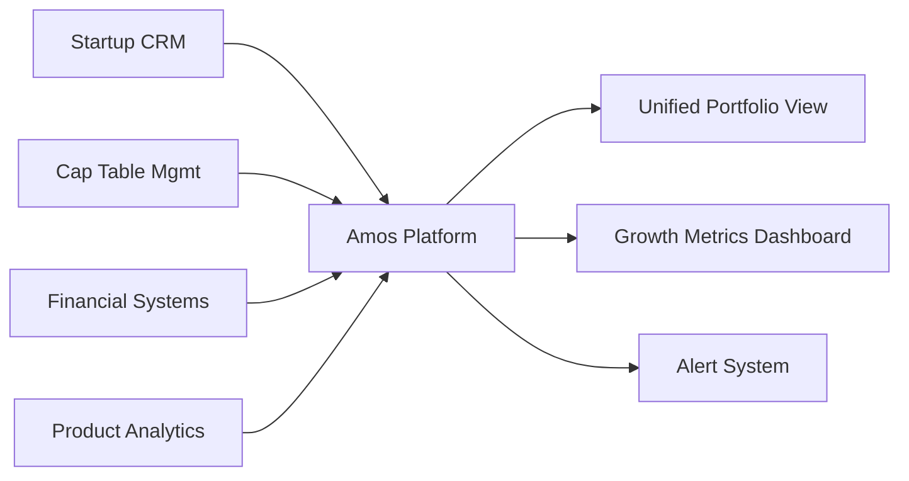
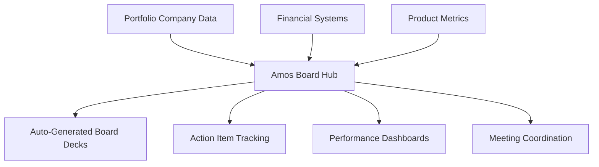

Venture capital funds operate in fast-moving markets where speed and agility are competitive advantages. Amos transforms VC operations by automating portfolio management, enabling real-time startup tracking, and streamlining investor communications while maintaining the flexibility that VC funds need.

## Key VC Operational Challenges

<CardGroup cols={2}>
  <Card title="Portfolio Scaling" icon="rocket">
    Managing 50-100+ portfolio companies with varying data systems, growth stages, and reporting capabilities.
  </Card>
  
  <Card title="Rapid Decision Making" icon="zap">
    Making investment decisions quickly with limited data and supporting portfolio companies through rapid scaling phases.
  </Card>
  
  <Card title="Board Management" icon="users">
    Coordinating board meetings, tracking action items, and maintaining relationships across diverse portfolio companies.
  </Card>
  
  <Card title="Exit Planning" icon="trending-up">
    Identifying exit opportunities, preparing companies for liquidity events, and maximizing returns for LPs.
  </Card>
</CardGroup>

## Scenario 1: Portfolio Company Growth Tracking

### The Challenge
A Series A-focused VC fund with 75 portfolio companies struggled to maintain visibility into startup performance across different growth stages. Monthly updates were inconsistent, making it difficult to identify companies needing support or approaching key milestones.

### Amos Solution Implementation

#### Adapt Phase: Connect Diverse Startup Systems

- **Week 1-2**: Integrate with common startup tools (Salesforce, Carta, QuickBooks, Mixpanel)
- **Week 3-4**: Standardize KPI collection across portfolio companies
- **Outcome**: Real-time visibility into portfolio performance

#### Align Phase: Standardize Growth Metrics
- **KPI Framework**: Consistent metrics across different business models (SaaS, marketplace, hardware)
- **Reporting Cadence**: Automated monthly updates with exception-based alerts
- **Benchmarking**: Peer comparison and industry standard tracking

#### Upgrade Phase: Predictive Portfolio Intelligence
- **Growth Trajectory Modeling**: Predict runway, next funding needs, and exit timing
- **Risk Assessment**: Early warning systems for companies facing challenges
- **Opportunity Identification**: Automated identification of follow-on investment opportunities

### Portfolio Management Results

<CardGroup cols={3}>
  <Card title="Portfolio Visibility" icon="eye">
    **Real-time tracking** of 75+ companies with automated KPI collection
  </Card>
  
  <Card title="Response Speed" icon="clock">
    **80% faster** identification of companies needing support or intervention
  </Card>
  
  <Card title="Follow-on Success" icon="repeat">
    **40% improvement** in follow-on investment decision accuracy
  </Card>
</CardGroup>

## Scenario 2: Board Meeting Automation & Management

### The Challenge
A growth-stage VC fund was managing 40+ board seats, requiring 20-30 hours per week coordinating meetings, preparing materials, and tracking action items. Board packages were often incomplete or outdated due to manual data collection.

### Amos Solution: Intelligent Board Management

#### Current State: Manual Board Coordination
- **Meeting Prep**: 3-4 hours per board meeting gathering data and creating presentations
- **Action Tracking**: Manual spreadsheets with limited follow-up capabilities
- **Document Management**: Email-based sharing with version control issues
- **Performance Updates**: Static reports with limited interactive analysis

#### Amos Transformation: Automated Board Operations

**Board Management Features:**
1. **Automated Board Packages**: Real-time data integration into standardized templates
2. **Action Item Tracking**: Automated follow-up and progress monitoring
3. **Performance Dashboards**: Interactive analytics for board discussions
4. **Meeting Coordination**: Integrated scheduling and document distribution

### Board Management Outcomes

| Process | Before Amos | After Amos | Improvement |
|---------|-------------|------------|-------------|
| **Board Prep Time** | 3-4 hours | 30 minutes | 85% reduction |
| **Data Accuracy** | 70% (manual updates) | 95% (real-time) | 25% improvement |
| **Action Item Completion** | 60% follow-through | 90% completion | 50% improvement |
| **Board Satisfaction** | Mixed feedback | Consistently positive | Qualitative improvement |

## Scenario 3: Investor Reporting & LP Communications

### The Challenge
A multi-stage VC fund with $500M AUM was spending 4-5 weeks each quarter preparing LP reports, struggling to provide timely updates on portfolio performance and market conditions in fast-moving sectors.

### Amos Solution: Real-time Investor Relations

#### Quarterly Reporting Transformation

**Before Amos:**
- Week 1-2: Manual data collection from 80+ portfolio companies
- Week 3: Consolidation and analysis of performance metrics
- Week 4-5: Report writing, review, and distribution

**After Amos:**
- **Continuous Data Flow**: Real-time integration with portfolio company systems
- **Automated Analytics**: Dynamic performance analysis and benchmarking
- **Template-driven Reports**: Consistent formatting with custom insights
- **Interactive Dashboards**: LP portal with self-service capabilities

#### LP Communication Enhancement

<CardGroup cols={2}>
  <Card title="Quarterly Reports" icon="file-text">
    - Real-time portfolio performance data
    - Automated market analysis and trends
    - Interactive charts and benchmarking
    - 90% reduction in preparation time
  </Card>
  
  <Card title="LP Portal" icon="desktop">
    - Self-service portfolio analytics
    - Company-level performance tracking
    - Market intelligence and insights
    - Secure document sharing
  </Card>
</CardGroup>

## Scenario 4: Exit Planning & Value Maximization

### The Challenge
A late-stage VC fund needed better visibility into exit readiness across portfolio companies, often missing optimal exit windows due to limited real-time performance data and market intelligence.

### Amos Solution: Intelligent Exit Management

#### Exit Readiness Framework
- **Performance Tracking**: Real-time monitoring of exit-relevant metrics (revenue growth, market position, competitive landscape)
- **Market Intelligence**: Automated tracking of M&A activity and public market conditions
- **Readiness Scoring**: AI-powered assessment of exit timing and valuation potential
- **Process Management**: Coordinated workflow for due diligence and transaction support

#### Exit Planning Results

<CardGroup cols={3}>
  <Card title="Exit Timing" icon="calendar">
    **50% improvement** in optimal exit window identification
  </Card>
  
  <Card title="Valuation Optimization" icon="dollar-sign">
    **15-20% higher** average exit valuations through better preparation
  </Card>
  
  <Card title="Process Efficiency" icon="workflow">
    **60% faster** exit process execution with automated data rooms
  </Card>
</CardGroup>

## VC-Specific Amos Features

### Portfolio Intelligence Suite
- **Growth Metrics Tracking**: Standardized KPIs across different business models and stages
- **Benchmarking Analytics**: Peer comparison and industry standard analysis
- **Predictive Modeling**: Growth trajectory and funding need predictions

### Board Management Platform
- **Automated Board Packages**: Real-time data integration into presentation templates
- **Action Item Tracking**: Centralized task management with automated follow-up
- **Performance Dashboards**: Interactive analytics for board discussions

### Investor Relations Hub
- **Real-time Reporting**: Continuous LP updates with portfolio performance data
- **Market Intelligence**: Automated sector analysis and competitive tracking
- **LP Portal**: Self-service access with role-based permissions

### Exit Optimization Tools
- **Readiness Assessment**: AI-powered evaluation of exit timing and preparation
- **Market Monitoring**: Automated tracking of M&A activity and market conditions
- **Process Management**: Coordinated workflows for transaction execution

## Implementation Roadmap for VC Funds

### Phase 1: Portfolio Foundation (Months 1-2)
- Connect portfolio company data sources and standardize KPI collection
- Implement basic reporting automation and performance dashboards
- Establish data governance for diverse startup systems

### Phase 2: Operational Enhancement (Months 3-4)
- Deploy board management automation and LP reporting capabilities
- Integrate market intelligence and benchmarking analytics
- Launch investor portal with self-service capabilities

### Phase 3: Strategic Optimization (Months 5-6)
- Enable predictive analytics for growth and exit planning
- Implement AI-powered portfolio optimization and risk assessment
- Deploy advanced market intelligence and competitive analysis

## ROI Analysis for VC Funds

### Operational Efficiency Gains
- **Portfolio Management**: 70% reduction in manual tracking and reporting time
- **Board Operations**: 85% decrease in meeting preparation time
- **LP Reporting**: 90% faster quarterly report generation

### Investment Performance Enhancement
- **Decision Speed**: 50% faster investment decision-making with real-time data
- **Portfolio Support**: 40% improvement in identifying companies needing assistance
- **Exit Optimization**: 15-20% higher average exit valuations

### Cost Savings & Revenue Impact
- **Operational Costs**: $300K-$500K annual savings in manual processes
- **Technology Consolidation**: 40% reduction in portfolio company tool costs
- **Fund Performance**: 2-5% improvement in overall fund returns through better portfolio management

## VC Fund Size Considerations

### Early-Stage Funds ($50M-$200M)
- **Focus**: Portfolio tracking and board management automation
- **Key Benefits**: Operational efficiency and LP reporting improvements
- **Implementation**: 2-3 month rollout with emphasis on core features

### Growth-Stage Funds ($200M-$1B)
- **Focus**: Advanced analytics and exit optimization
- **Key Benefits**: Enhanced decision-making and portfolio value creation
- **Implementation**: 4-6 month rollout with full feature deployment

### Multi-Stage Funds ($1B+)
- **Focus**: Comprehensive platform with AI-powered insights
- **Key Benefits**: Strategic portfolio optimization and market intelligence
- **Implementation**: 6+ month rollout with custom integrations

## Getting Started

<Card title="VC Fund Assessment" icon="clipboard-check" href="/fund-leaders/implementation/getting-started">
  Complete our VC-specific readiness assessment to identify your highest-impact implementation priorities and expected outcomes.
</Card>

## Success Stories

Discover how VC funds are transforming their operations:

<CardGroup cols={2}>
  <Card title="Series A Fund" icon="rocket" href="/fund-leaders/success-stories/case-study-1">
    $200M fund improved portfolio visibility across 60+ companies and reduced board prep time by 85%.
  </Card>
  
  <Card title="Growth-Stage Fund" icon="chart-line" href="/fund-leaders/success-stories/case-study-2">
    $750M fund enhanced exit planning and achieved 20% higher average valuations.
  </Card>
</CardGroup>

## AI Readiness for VC Funds

Venture capital is uniquely positioned to benefit from AI-powered insights:

### Investment Decision Support
- **Deal Scoring**: ML-powered evaluation of investment opportunities
- **Market Analysis**: Automated competitive intelligence and trend identification
- **Due Diligence**: AI-assisted risk assessment and opportunity validation

### Portfolio Optimization
- **Growth Prediction**: Forecasting portfolio company trajectories and funding needs
- **Resource Allocation**: Optimizing partner time and support resource deployment
- **Exit Timing**: Predictive modeling for optimal liquidity event timing

### Market Intelligence
- **Trend Detection**: Early identification of emerging market opportunities
- **Competitive Analysis**: Automated tracking of competitive landscape changes
- **Sector Insights**: AI-powered analysis of sector-specific performance patterns

The venture capital industry's fast-paced, data-driven nature makes it an ideal candidate for AI enhancement, and Amos provides the unified data foundation necessary for successful AI implementations.

Ready to transform your VC operations? Explore our [implementation guide](/fund-leaders/implementation/getting-started) or [schedule a consultation](/contact) to discuss your specific needs.