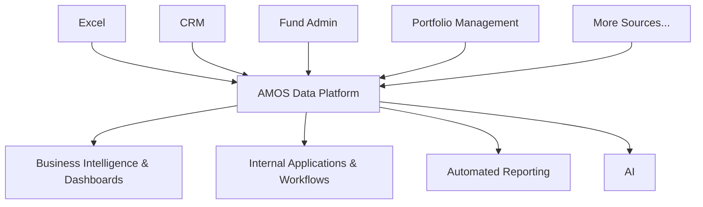

import { Card, CardGroup } from 'nextra/components'

AMOS is an open-source data platform designed specifically for fund operations. It provides the unified data infrastructure that modern investment funds need to operate efficiently and make data-driven decisions.

## Why funds use AMOS

Investment data is usually fragmented across accounting systems, CRMs, spreadsheets, fund administrators, and third-party providers. Definitions drift. Reconciliation is manual. Reporting is reactive. AMOS addresses this by creating a single governed layer of truth that can be trusted by investment, finance, and operations teams.

<Note>
**Open source by design**: transparent code, auditable data handling, no vendor lock-in.
</Note>

## How it works

At its core, AMOS is a modular data transformation framework that runs on any modern data platform, cloud or on-prem. It sits between source systems and consumption tools, ingesting, reconciling, and standardizing data into a clean operational layer.

<Card>

</Card>

## Who can implement it

AMOS is fully open source and can be deployed by internal IT or data teams using standard tooling.

For funds that prefer a guided rollout, the AMOS core team — composed of senior private markets operators and data engineers — can support implementation and manage adoption across teams.

Change management is an intentional part of the model: clear ownership, measurable adoption checkpoints, and minimal disruption to existing workflows.